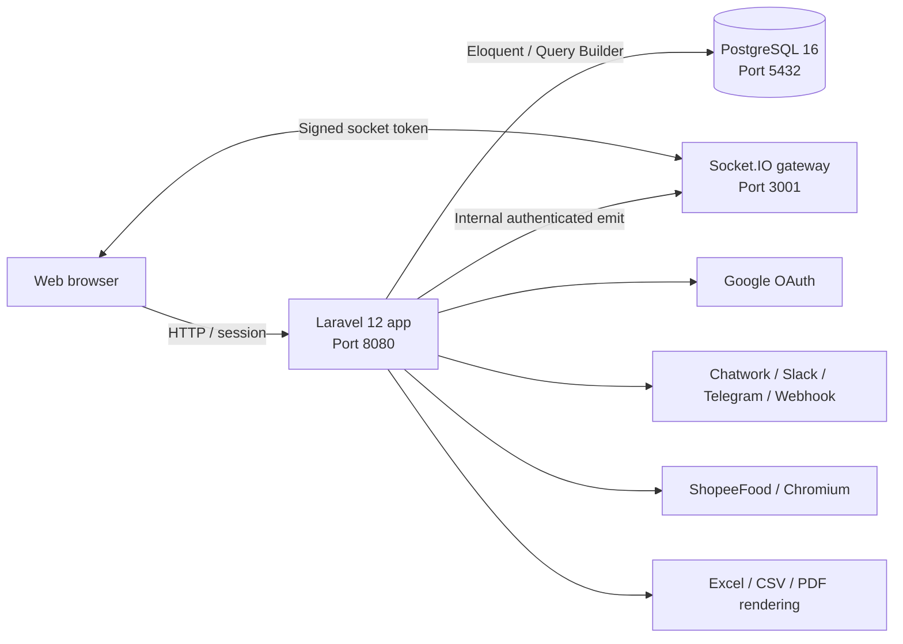

# DrinkFlow

DrinkFlow là hệ thống quản lý đặt đồ uống/đồ ăn theo nhóm dành cho doanh nghiệp. Hệ thống tổ chức người dùng theo nhiều **Room**, vận hành các **Campaign** đặt món, tổng hợp **Order**, chia hóa đơn, theo dõi **Debt**, thanh toán qua VietQR và cập nhật trạng thái theo thời gian thực.

Ứng dụng được xây dựng theo mô hình Laravel monolith làm nguồn dữ liệu và nơi quyết định phân quyền, kết hợp một Socket.IO gateway chỉ đảm nhiệm truyền sự kiện realtime. Cơ sở dữ liệu chính thức duy nhất là PostgreSQL; trình duyệt không truy cập trực tiếp cơ sở dữ liệu và dự án không sử dụng Supabase.

## Mục lục

- [Tổng quan chức năng](#tổng-quan-chức-năng)
- [Vai trò và phạm vi dữ liệu](#vai-trò-và-phạm-vi-dữ-liệu)
- [Kiến trúc hệ thống](#kiến-trúc-hệ-thống)
- [Công nghệ sử dụng](#công-nghệ-sử-dụng)
- [Cấu trúc mã nguồn](#cấu-trúc-mã-nguồn)
- [Mô hình nghiệp vụ](#mô-hình-nghiệp-vụ)
- [Cài đặt và chạy bằng Docker](#cài-đặt-và-chạy-bằng-docker)
- [Chạy trực tiếp trên máy phát triển](#chạy-trực-tiếp-trên-máy-phát-triển)
- [Cấu hình môi trường](#cấu-hình-môi-trường)
- [Realtime](#realtime)
- [Queue, scheduler và dọn dữ liệu](#queue-scheduler-và-dọn-dữ-liệu)
- [Kiểm thử và chất lượng mã nguồn](#kiểm-thử-và-chất-lượng-mã-nguồn)
- [Triển khai](#triển-khai)
- [Tài liệu liên quan](#tài-liệu-liên-quan)

## Tổng quan chức năng

### Cổng công khai

- Landing page, điều khoản sử dụng, lịch sử phiên bản và trang liên hệ.
- Giao diện đa ngôn ngữ: tiếng Việt, tiếng Anh và tiếng Nhật.
- Form liên hệ có CAPTCHA và rate limit chống spam.
- Google OAuth với danh sách domain được phép cấu hình theo môi trường.

### Người dùng

- Một danh tính toàn hệ thống (`GlobalUser`) có thể tham gia nhiều Room.
- Tham gia Room bằng mã mời; mỗi membership được biểu diễn bởi một `RoomUser` riêng.
- Dashboard toàn hệ thống tại `/me` và dashboard riêng cho từng Room.
- Xem chiến dịch đang mở, chọn món, size, topping, mức đường/đá và quản lý giỏ hàng.
- Tạo đơn, theo dõi trạng thái đơn, lịch sử đặt món và xác nhận thanh toán.
- Xem công nợ, gửi yêu cầu xác nhận thanh toán và nhận nhắc nợ.
- Xem thống kê cá nhân, sao kê thanh toán và xuất dữ liệu Excel.
- Quản lý hồ sơ, phiên đăng nhập/thiết bị, thông báo, phản hồi và yêu cầu xóa tài khoản.
- Xử lý trạng thái tài khoản bị khóa và gửi khiếu nại.

### Quản trị Room

- Dashboard theo Room, báo cáo vận hành và nhật ký hoạt động.
- Tạo, sửa, nhân bản, kích hoạt, đóng, hủy và lưu trữ Campaign.
- Quản lý menu, hình ảnh, size, topping và trạng thái từng món.
- Nhập menu từ ShopeeFood bằng Chromium/Puppeteer hoặc qua Data Gateway.
- Theo dõi đơn theo thời gian thực; cập nhật hàng loạt, hủy, mở khóa và xuất tổng hợp.
- Chia hóa đơn theo phí giao hàng, giảm giá và tài trợ của chiến dịch.
- Quản lý sổ công nợ, điều chỉnh, ghi nhận/duyệt thanh toán, quyết toán và gửi nhắc nợ.
- Quản lý thành viên Room, trạng thái thành viên và thiết bị tin cậy.
- Quản lý tài khoản nhận tiền, tạo VietQR và chọn tài khoản mặc định cho Room.
- Cấu hình kênh thông báo Chatwork, Slack, Telegram hoặc webhook tùy chỉnh.
- Quản lý hồ sơ admin, đổi mật khẩu, xác thực hai bước và luồng quên mật khẩu bằng OTP.

### Superadmin

- Quản lý toàn bộ Room, tài khoản Admin và phân công Admin vào Room.
- Quản lý Global User, membership, thiết bị, khóa/mở khóa và hợp nhất tài khoản trùng.
- Giám sát/can thiệp Campaign, công nợ và xuất báo cáo toàn hệ thống.
- Quản lý cấu hình hệ thống, maintenance mode, phiên bản và kênh thông báo hệ thống.
- Theo dõi audit log, security event, trạng thái Socket.IO và failed queue jobs.
- Retry/xóa failed job và thực hiện system reset có kiểm soát.

## Vai trò và phạm vi dữ liệu

| Actor | Phạm vi | Xác thực | Quyền chính |
| --- | --- | --- | --- |
| User | Dữ liệu cá nhân và các Room đã tham gia | Google OAuth, session và trusted device | Đặt món, theo dõi đơn/công nợ, thống kê cá nhân |
| Admin | Chỉ các Room được phân công | Guard `admin`, mật khẩu, tùy chọn 2FA | Vận hành campaign, order, debt và thành viên Room |
| Superadmin | Toàn hệ thống | Guard `admin` với role `superadmin` | Quản trị tenant, actor, hệ thống, audit và vận hành |

Danh tính người dùng được phân lớp như sau:

```text
Google Identity
      |
      v
 Global User
      |
      +---- Room User (Room A) ---- Trusted Devices
      |
      +---- Room User (Room B) ---- Trusted Devices
```

`GlobalUser` và `RoomUser` không thể dùng thay thế cho nhau. Mọi dữ liệu đơn hàng, công nợ và quyền truy cập trong Room phải gắn đúng `room_user_id`; Admin chỉ được thao tác trong các Room đã được cấp quyền.

## Kiến trúc hệ thống



### Nguyên tắc kiến trúc

- Laravel là source of truth cho nghiệp vụ, xác thực và authorization.
- PostgreSQL 16 là cơ sở dữ liệu duy nhất. Không có client-side database SDK.
- Socket.IO không tự quyết định quyền; gateway chỉ xác minh token ngắn hạn do Laravel ký và tự join các channel đã được cấp.
- Controller được tách theo actor (`User`, `Admin`, `Superadmin`); logic nghiệp vụ nằm trong Action/Service để tái sử dụng.
- Các trạng thái nghiệp vụ được quản lý bằng PHP Enum hoặc model constants thay vì magic string.
- Invariant quan trọng được bảo vệ bằng foreign key/unique index ở tầng cơ sở dữ liệu.

### Các service Docker

Mô hình triển khai được hỗ trợ hiện tại là một VPS chạy một instance Laravel và một realtime gateway. Không triển khai nhiều gateway replica nếu chưa bổ sung cơ chế chia sẻ Socket.IO state.

| Service | Container mặc định | Cổng host | Vai trò |
| --- | --- | --- | --- |
| `postgres` | `drinkflow-new-postgres-1` | `5432` | PostgreSQL 16 và persistent volume |
| `app` | `drinkflow-new-app-1` | `8080` | Laravel/PHP 8.3; tự chạy migration khi khởi động |
| `queue` | `drinkflow-new-queue-1` | — | Database queue worker và retry realtime |
| `realtime` | `drinkflow-new-realtime-1` | `3001` | Socket.IO gateway và health endpoint |

Health check:

Realtime health là endpoint nội bộ, cần header `X-Realtime-Secret`; Laravel Superadmin tự gửi header này khi đọc socket monitoring.

- Laravel: `http://localhost:8080/up`
- Realtime: `http://localhost:3001/health`

## Công nghệ sử dụng

### Backend

- PHP 8.2+; Docker image sử dụng PHP 8.3 CLI.
- Laravel 12, Eloquent ORM, database session/cache/queue.
- PostgreSQL 16.
- Maatwebsite Excel cho Excel/CSV.
- Intervention Image cho xử lý ảnh.
- Mews Captcha cho form công khai.
- Spatie Browsershot và Chromium/Puppeteer cho tác vụ trình duyệt/render.

### Frontend

- Blade components và Vite 7.
- Tailwind CSS 4.
- React 19 cho các vùng giao diện tương tác.
- Axios và React Toastify.
- Giao diện dịch qua các bộ từ khóa `vi`, `en`, `ja`.

### Realtime

- Node.js 22.
- Socket.IO 4.
- Token HMAC SHA-256 có thời hạn.
- Internal HTTP endpoint có shared secret để Laravel phát sự kiện.

## Cấu trúc mã nguồn

```text
Drinkflow-New/
|-- docker-compose.yml       # PostgreSQL, Laravel và Socket.IO
|-- Dockerfile               # Build frontend + runtime PHP/Chromium
|-- start.js                 # Orchestrator chạy local 4 tiến trình
|-- realtime/
|   |-- server.js            # Socket.IO gateway
|   `-- README.md            # Ghi chú riêng về realtime
|-- src/                     # Ứng dụng Laravel
|   |-- app/
|   |   |-- Actions/         # Use case thay đổi trạng thái nghiệp vụ
|   |   |-- Enums/           # Trạng thái/role dùng chung
|   |   |-- Events/          # Domain/application events
|   |   |-- Exports/         # Excel/CSV exports
|   |   |-- Http/
|   |   |   |-- Controllers/ # Public, User, Admin, Superadmin
|   |   |   |-- Middleware/  # Actor, Room access, locale, maintenance
|   |   |   `-- Requests/    # Validation và authorization
|   |   |-- Listeners/       # Notification và realtime publishers
|   |   |-- Models/          # Eloquent models
|   |   `-- Services/        # Logic dùng chung theo domain
|   |-- database/
|   |   |-- migrations/      # PostgreSQL schema
|   |   `-- seeders/         # Dữ liệu demo/phát triển
|   |-- lang/{vi,en,ja}/     # Bản dịch giao diện
|   |-- resources/views/     # Blade views và components
|   |-- routes/              # web.php + route theo actor
|   `-- tests/               # Unit và Feature tests
`-- documents/               # Đặc tả tính năng và hướng dẫn triển khai
```

Các route chính:

- Public: `/`, `/terms`, `/versions`, `/contact`.
- User global: `/me/*`.
- User theo Room: `/rooms/{room}/*`.
- Admin login/profile: `/admin/*`.
- Admin theo Room: `/admin/{room}/*`.
- Superadmin: `/superadmin/*`.

Ứng dụng hiện không khai báo `routes/api.php`; các endpoint JSON nằm trong các route web tương ứng và vẫn chịu middleware/authorization của actor.

## Mô hình nghiệp vụ

### Thực thể chính

| Nhóm | Thực thể |
| --- | --- |
| Identity | `GlobalUser`, `OAuthIdentity`, `RoomUser`, `RoomUserDevice`, `AdminAccount` |
| Room | `Room`, `RoomSetting`, `PaymentAccount`, `NotificationChannel` |
| Campaign/Menu | `Campaign`, `CampaignParticipant`, `CampaignItem`, `CampaignItemSize`, `CampaignItemTopping` |
| Order | `Order`, `OrderItem`, `OrderItemTopping` |
| Debt/Payment | `Debt`, `DebtPayment`, `DebtAdjustment` |
| Operations | `UserNotification`, `AdminNotification`, `AuditLog`, `SecurityEvent`, `SystemSetting` |
| Public/System | `ContactInquiry`, `Feedback`, `Version`, `CrawlerPreview`, `SystemNotificationChannel` |

### Luồng đặt món

```text
Admin tạo Campaign và menu
  -> kích hoạt Campaign
  -> User tham gia/chọn món
  -> tạo Order
  -> Admin đóng Campaign và chia hóa đơn
  -> phát sinh/điều chỉnh Debt
  -> User xác nhận thanh toán
  -> Admin duyệt thanh toán
  -> hoàn tất đối soát
```

Campaign có vòng đời được kiểm soát bởi action/enum, hỗ trợ trạng thái nháp, đang hoạt động, đang giao, đã đóng, đã hủy và lưu trữ tùy ngữ cảnh. Order và Debt có state transition riêng; không nên cập nhật trực tiếp chuỗi trạng thái bên ngoài các Action/Service hiện có.

### Tiền tệ và chia hóa đơn

- Giá món, topping, phí giao hàng, giảm giá, tài trợ và công nợ được lưu bằng kiểu số nguyên/decimal phù hợp ở backend.
- Chiến dịch hỗ trợ phân bổ phí giao hàng, giảm giá và tài trợ trước khi xác định số tiền cuối cùng của từng đơn.
- Mỗi Room có thể có nhiều tài khoản thanh toán nhưng invariant “một tài khoản mặc định” được bảo vệ ở tầng dữ liệu.
- VietQR được tạo từ tài khoản nhận tiền và nội dung thanh toán của order/debt.

## Cài đặt và chạy bằng Docker

### Yêu cầu

- Docker Desktop hoặc Docker Engine có Docker Compose v2.
- Git.
- Các cổng `5432`, `8080`, `3001` đang trống hoặc được đổi trong `docker-compose.yml`.

### 1. Chuẩn bị biến môi trường

Từ thư mục root của dự án:

```powershell
Copy-Item .env.example .env
Copy-Item src/.env.example src/.env
```

Tạo `APP_KEY` bằng image ứng dụng sau khi build:

```powershell
docker compose build app
docker compose run --rm app php artisan key:generate
```

Thiết lập tối thiểu trong `src/.env`:

```dotenv
APP_NAME=DrinkFlow
APP_ENV=local
APP_DEBUG=true
APP_URL=http://localhost:8080

DB_CONNECTION=pgsql
DB_HOST=postgres
DB_PORT=5432
DB_DATABASE=drinkflow
DB_USERNAME=drinkflow
DB_PASSWORD=drinkflow_secret

REALTIME_URL=http://realtime:3001
REALTIME_PUBLIC_URL=http://localhost:3001
REALTIME_INTERNAL_SECRET=replace-with-a-long-random-secret
```

Không commit `.env`, token OAuth, webhook secret hoặc thông tin đăng nhập thật.

### 2. Khởi động hệ thống

```powershell
docker compose up -d --build
docker compose ps
```

Service `app` tự chạy `php artisan migrate --force` trước khi mở web server.

Truy cập:

- Web: <http://localhost:8080>
- Admin: <http://localhost:8080/admin/login>
- Realtime health (internal): <http://localhost:3001/health> với header `X-Realtime-Secret`

Theo dõi log:

```powershell
docker compose logs -f app queue realtime postgres
```

### 3. Tạo dữ liệu phát triển (tùy chọn)

```powershell
docker exec drinkflow-new-app-1 php artisan db:seed
```

Seeder tạo dữ liệu Room/Campaign/Order mẫu và hai tài khoản quản trị chỉ dùng cho local:

| Vai trò | Email | Mật khẩu |
| --- | --- | --- |
| Admin | `admin@drinkflow.local` | `password` |
| Superadmin | `superadmin@drinkflow.local` | `password` |

Phải đổi hoặc vô hiệu hóa các tài khoản mẫu trước khi dùng dữ liệu seed ở bất kỳ môi trường chia sẻ nào.

### 4. Dừng hệ thống

```powershell
docker compose down
```

Lệnh trên giữ nguyên PostgreSQL volume. Chỉ xóa volume khi chủ động muốn mất toàn bộ dữ liệu phát triển:

```powershell
docker compose down --volumes
```

## Chạy trực tiếp trên máy phát triển

Docker là cách chạy khuyến nghị. Nếu chạy service trực tiếp trên host, cần:

- PHP 8.2+ với `bcmath`, `gd`, `mbstring`, `pdo_pgsql`, `zip`.
- Composer 2.
- Node.js 22 và npm.
- PostgreSQL 16.
- Chrome/Chromium nếu sử dụng Food Crawler/Browsershot.

Cài dependency:

```powershell
Set-Location src
composer install
npm install
Copy-Item .env.example .env
php artisan key:generate
php artisan migrate
Set-Location ..\realtime
npm install
Set-Location ..
```

Khi chạy PostgreSQL trên host, đổi `DB_HOST` trong `src/.env` từ `postgres` thành hostname phù hợp, thường là `127.0.0.1`.

Chạy đồng thời Laravel, Vite và realtime gateway:

```powershell
npm install
npm start
```

`start.js` sẽ clear config/view/route cache, restart queue worker cũ rồi mở Laravel ở cổng `8080`, queue worker, Vite dev server và Socket.IO ở cổng `3001`. Scheduler vẫn cần chạy ở tiến trình riêng:

```powershell
Set-Location src
php artisan queue:work
php artisan schedule:work
```

## Cấu hình môi trường

| Biến | Mục đích | Giá trị local điển hình |
| --- | --- | --- |
| `APP_URL` | URL công khai của Laravel | `http://localhost:8080` |
| `APP_LOCALE` | Ngôn ngữ mặc định | `vi` |
| `DB_*` | Kết nối PostgreSQL | Host Docker là `postgres` |
| `SESSION_DRIVER` | Lưu session | `database` |
| `QUEUE_CONNECTION` | Queue backend | `database` |
| `GOOGLE_CLIENT_ID` | OAuth client ID | Lấy từ Google Cloud Console |
| `GOOGLE_CLIENT_SECRET` | OAuth client secret | Bí mật, không commit |
| `GOOGLE_REDIRECT_URI` | Callback OAuth | `${APP_URL}/auth/google/callback` |
| `GOOGLE_ALLOWED_DOMAINS` | Danh sách domain email, phân tách bằng dấu phẩy | `company.com` |
| `REALTIME_URL` | URL nội bộ Laravel gọi gateway | `http://realtime:3001` |
| `REALTIME_PUBLIC_URL` | URL trình duyệt kết nối Socket.IO | `http://localhost:3001` |
| `REALTIME_INTERNAL_SECRET` | Shared secret cho `/internal/emit` | Chuỗi ngẫu nhiên dài |
| `SOCKET_TOKEN_SECRET` | Secret ký socket token; nếu trống dùng `APP_KEY` | Nên cấu hình riêng ở production |
| `CORS_ORIGIN` | Origin được realtime gateway cho phép | `http://localhost:8080` |
| `FOOD_CRAWLER_CHROME_PATH` | Đường dẫn Chrome/Chromium | Docker: `/usr/bin/chromium` |
| `FOOD_CRAWLER_*` | Binary Node/npm, timeout, headless, profile và diagnostics | Xem `src/config/food-crawler.php` |
| `MAIL_*` | Gửi OTP reset mật khẩu Admin | Local mặc định ghi log |

Khi thay đổi `.env`, chạy:

```powershell
docker exec drinkflow-new-app-1 php artisan optimize:clear
```

### Google OAuth

Callback cần đăng ký tại Google Cloud Console:

```text
http://localhost:8080/auth/google/callback
```

Nếu `GOOGLE_ALLOWED_DOMAINS` có giá trị, chỉ email thuộc các domain đó được chấp nhận. Nhiều domain được phân tách bằng dấu phẩy.

### Food Crawler

Provider hiện có là ShopeeFood. Trong Docker, image đã cài Chromium, Node.js và Puppeteer. Khi chạy trên Windows host cần kiểm tra lại các biến đường dẫn `FOOD_CRAWLER_CHROME_PATH`, `FOOD_CRAWLER_NODE_BINARY` và `FOOD_CRAWLER_NPM_BINARY`.

## Realtime

Laravel cấp token ngắn hạn cho từng actor. Gateway xác minh chữ ký và chỉ cho socket vào các channel có trong claims:

| Channel | Đối tượng |
| --- | --- |
| `user:{roomUserId}` | Sự kiện cá nhân trong một Room |
| `global_user:{globalUserId}` | Sự kiện toàn cục của người dùng |
| `room:{roomId}` | Broadcast trong Room |
| `admin:{adminId}` | Sự kiện riêng của Admin |
| `superadmin` | Sự kiện dành cho Superadmin |
| `system` | Sự kiện vận hành toàn hệ thống |

Luồng phát sự kiện:

```text
Domain event trong Laravel
  -> Listener tạo notification nếu cần
  -> POST /internal/emit kèm X-Realtime-Secret
  -> Gateway kiểm tra event/channel
  -> Socket.IO broadcast đến channel đã authorize
```

Gateway chỉ chấp nhận danh sách event cho phép, kiểm tra shared secret cho internal emit và không tin tưởng ID channel do browser tự gửi. Endpoint `/health` chỉ trả số liệu kết nối/tình trạng xác thực, không trả payload socket.

Xem thêm [realtime/README.md](realtime/README.md).

## Queue, scheduler và dọn dữ liệu

Queue sử dụng database driver theo cấu hình mặc định. Chạy worker trong môi trường phát triển:

```powershell
docker exec drinkflow-new-app-1 php artisan queue:work --tries=3
```

Chạy scheduler dài hạn:

```powershell
docker exec drinkflow-new-app-1 php artisan schedule:work
```

Scheduler gọi lệnh sau mỗi ngày lúc `02:15` và chống chạy trùng:

```powershell
docker exec drinkflow-new-app-1 php artisan drinkflow:prune-operational-data
```

Lệnh dọn audit log hết hạn, admin notification đã đọc và crawler preview theo retention trong `src/config/retention.php`.

## Kiểm thử và chất lượng mã nguồn

Chạy toàn bộ test suite bằng container ứng dụng:

```powershell
docker exec drinkflow-new-app-1 php artisan test
```

Chạy một nhóm test:

```powershell
docker exec drinkflow-new-app-1 php artisan test --filter=RealtimeFlowTest
```

Build frontend production:

```powershell
docker compose exec -T app npm run build
```

Kiểm tra format PHP:

```powershell
docker exec drinkflow-new-app-1 vendor/bin/pint --test
```

Definition of Done của dự án:

1. Controller mỏng, validation rõ ràng, nghiệp vụ đặt trong Action/Service phù hợp.
2. PHP class/service/controller/action dùng strict types, type hints và PHPDoc đầy đủ.
3. Không hardcode role/status/type; dùng Enum hoặc model constants.
4. Không rò rỉ secret, credential hoặc token.
5. Nội dung UI có đủ khóa dịch `vi`, `en`, `ja`.
6. Mọi ảnh Blade có `loading="lazy"`, `alt` có ý nghĩa và fallback khi lỗi.
7. Toàn bộ test phải pass, không có warning hoặc syntax error.

## Bảo mật

- Public form áp dụng CAPTCHA và rate limiter.
- Google OAuth có thể giới hạn domain công ty.
- Password Admin được hash; reset password dùng OTP có thời hạn qua mail.
- Middleware phân tách Global User, Room User, Admin Room access và Superadmin.
- Socket token có thời hạn, ký HMAC và không cho client tự claim channel.
- Cấu hình notification channel được lưu ở trường mã hóa và secret bị che khi trả về UI.
- Audit log và security event phục vụ truy vết thao tác quản trị.
- Input string đi qua middleware chuẩn hóa; Form Request đảm nhiệm validation/authorization.
- PostgreSQL strict typing được tôn trọng: phân biệt `id` số với `slug`/`code` chuỗi.

Không sử dụng credential mặc định, `APP_DEBUG=true`, mật khẩu PostgreSQL mẫu hoặc shared secret mẫu trên production.

## Triển khai

Tài liệu triển khai chi tiết nằm trong thư mục `documents/deploy/`:

- [Tổng quan triển khai](documents/deploy/README.md)
- [Triển khai Docker trên VPS](documents/deploy/docker-vps-deployment.md)
- [Triển khai standalone trên VPS](documents/deploy/standalone-vps-deployment.md)
- [Ghi chú Docker Compose](documents/deployment-docker-compose.md)

Checklist production tối thiểu:

1. Tắt debug, sinh `APP_KEY` và tất cả shared secret mạnh.
2. Dùng credential PostgreSQL riêng; không public cổng database nếu không cần.
3. Cấu hình HTTPS/reverse proxy và đúng `APP_URL`, `CORS_ORIGIN`, OAuth callback.
4. Cấu hình mail thật cho OTP, queue worker có process supervisor và cron/scheduler.
5. Build asset production, cache Laravel config/routes/views sau khi deploy.
6. Bảo đảm `storage`/`bootstrap/cache` có quyền ghi và có chiến lược backup PostgreSQL.
7. Chạy migration và toàn bộ test trước khi chuyển traffic.

## Tài liệu liên quan

- [Quy tắc dành cho agent và coding convention](AGENTS.md)
- [Tổng quan tính năng](documents/features/overview.md)
- [Đặc tả User](documents/features/user.md)
- [Đặc tả Admin](documents/features/admin.md)
- [Đặc tả Superadmin](documents/features/superadmin.md)
- [Thiết kế cơ sở dữ liệu](documents/features/database.md)
- [Progress checklist](documents/features/progress-checklist.md)
- [Quy chuẩn mã nguồn](documents/rules-code-convention.md)

## Ghi chú đóng góp

- Tạo branch riêng cho từng thay đổi và giữ commit tập trung theo một mục tiêu.
- Không chỉnh sửa migration cũ đã được dùng ở môi trường chia sẻ; tạo migration mới.
- Không truy vấn database trực tiếp từ frontend và không thêm Supabase SDK.
- Khi thêm text UI, cập nhật đồng thời `src/lang/vi`, `src/lang/en`, `src/lang/ja`.
- Khi thêm trang global user, đặt controller trong `App\\Http\\Controllers\\User\\Global`.
- Mọi thay đổi nghiệp vụ cần test tương ứng và phải chạy full test suite trước khi merge.

---

DrinkFlow hiện là dự án nội bộ và chưa có file giấy phép (`LICENSE`). Không mặc định xem mã nguồn là phần mềm nguồn mở cho đến khi chủ sở hữu dự án công bố giấy phép cụ thể.
