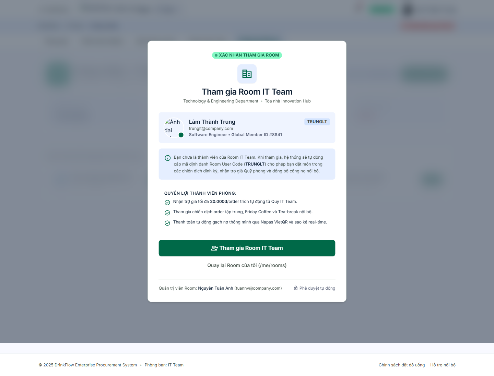
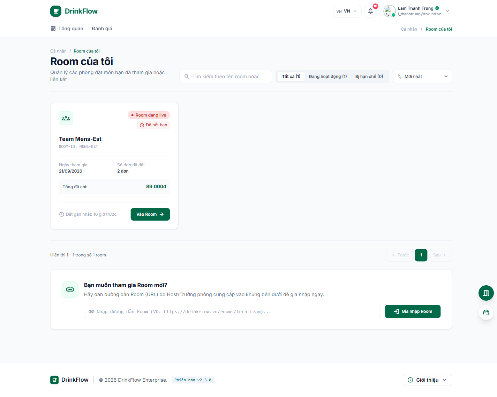
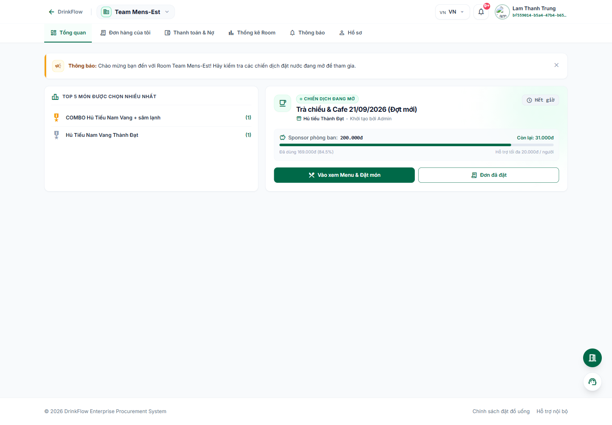

# 2. Tham gia & quản lý Room

<strong>📑 Menu điều hướng</strong> — bấm để chuyển nhanh sang trang khác

- [🏠 Trang chủ / Mục lục](README.md)
- [1. Đăng nhập & Cổng thông tin cá nhân](01-dang-nhap-va-cong-thong-tin.md)
- **2. Tham gia & quản lý Room** ← *đang xem*
- [3. Đặt món trong chiến dịch gom đơn](03-dat-mon-chien-dich.md)
- [4. Theo dõi đơn hàng](04-theo-doi-don-hang.md)
- [5. Thanh toán & Công nợ](05-thanh-toan-cong-no.md)
- [6. Thống kê chi tiêu](06-thong-ke-chi-tieu.md)
- [7. Hồ sơ cá nhân](07-ho-so-ca-nhan.md)
- [8. Bảo mật & thiết bị đăng nhập](08-bao-mat-thiet-bi.md)
- [9. Thông báo](09-thong-bao.md)
- [10. Đánh giá & góp ý](10-danh-gia-gop-y.md)
- [11. Khi tài khoản bị khoá / hạn chế](11-tai-khoan-bi-khoa.md)
- [12. Đặt món giúp thành viên khác (Order dùm)](12-dat-ho-thanh-vien-khac.md)
- [13. Món trả riêng (không dùng tài trợ)](13-mon-tra-rieng.md)

## 2.1. Room là gì?

**Room** là không gian đặt đồ uống/đồ ăn riêng cho một phòng ban, nhóm hoặc team trong công ty (ví dụ "Team Mens-Est", "Phòng Kỹ thuật"...). Mỗi Room do một Host/Quản trị viên phòng quản lý: mở các đợt gom đơn (chiến dịch), cấu hình trợ giá (sponsor), quản lý công nợ của thành viên trong Room đó.

Bạn có thể tham gia **nhiều Room cùng lúc** nếu được mời, và chuyển đổi qua lại dễ dàng.

## 2.2. Tham gia một Room mới

Có 2 cách, tuỳ vào việc bạn nhận link Room từ đâu:

### Cách 1 — Bấm thẳng vào link Room do Host chia sẻ

Host thường gửi link dạng `https://.../rooms/ten-phong` qua Slack/Google Chat/email. Bấm vào link đó:

1. Nếu bạn **chưa từng tham gia** Room này, hệ thống hiển thị trang **"Tham gia Room"** với thông tin phòng ban, quyền lợi thành viên (trợ giá, tham gia chiến dịch gom đơn, thanh toán tự động qua VietQR...).
2. Đọc kỹ thông tin rồi bấm **"Đồng ý tham gia"**.
3. Hệ thống tự động cấp cho bạn một **mã thành viên (User Code)** riêng trong Room này và đưa bạn vào trang Tổng quan của Room.

> Nếu bạn đã là thành viên của Room rồi, link sẽ đưa bạn thẳng vào trang Tổng quan Room mà không cần xác nhận lại.

### Cách 2 — Dán link Room vào ô "Gia nhập Room bằng liên kết"

Nếu bạn chỉ có link dạng văn bản (không bấm được, ví dụ được đọc qua điện thoại) hoặc muốn chủ động tham gia thêm Room khác:

1. Vào Cổng thông tin cá nhân `/me`.
2. Bấm nút nổi hình cửa 🚪 (**"Đăng ký tham gia phòng"**) ở góc dưới phải, **hoặc** vào **Room của tôi** → khung **"Bạn muốn tham gia Room mới?"**.
3. Dán URL Room vào ô nhập (định dạng `https://.../rooms/{tên-phòng}`).
4. Bấm **"Gia nhập Room"**.
5. Hệ thống sẽ điều hướng bạn sang trang xác nhận như Cách 1 ở trên.

## 2.3. Xem danh sách các Room đã tham gia

Vào **Room của tôi** (truy cập qua mục *"Xem tất cả"* ở khối "Room gần đây" trên `/me`, hoặc đường dẫn `/me/rooms`).

Tại đây bạn có thể:

- **Lọc** theo trạng thái: *Tất cả*, *Đang hoạt động*, *Bị hạn chế*.
- **Sắp xếp**: mới nhất, cũ nhất, tên A-Z, chi tiêu nhiều nhất.
- Xem nhanh cho từng Room: ngày tham gia, số đơn đã đặt, tổng đã chi, thời điểm đặt gần nhất.
- Bấm **"Vào Room"** để vào làm việc.

Nếu Room hiển thị nhãn **"Bị hạn chế"**, nghĩa là bạn đã bị Host tạm khoá quyền truy cập tại Room đó (khác với khoá toàn hệ thống) — xem thêm ở [bài 11](11-tai-khoan-bi-khoa.md).

## 2.4. Chuyển đổi giữa các Room

Khi đang ở trong một Room bất kỳ (ví dụ `/rooms/ten-phong/dashboard`), nhìn lên thanh trên cùng bên trái, bấm vào **tên Room hiện tại** (cạnh nút "DrinkFlow") để mở danh sách **"Chuyển Room"** — chọn Room khác để chuyển sang ngay mà không cần quay về `/me`.

## 2.5. Thanh điều hướng bên trong một Room

Sau khi vào Room, thanh điều hướng phía trên luôn hiển thị đủ 7 mục sau, dùng xuyên suốt các bài tiếp theo:

| Tab | Chức năng |
| --- | --------- |
| Tổng quan | Trang chính của Room: thông báo, cảnh báo công nợ, chiến dịch đang mở |
| Chiến dịch & Menu | Xem menu và đặt món trong đợt gom đơn đang mở ([bài 3](03-dat-mon-chien-dich.md)) |
| Đơn hàng của tôi | Theo dõi các đơn đã đặt trong Room này ([bài 4](04-theo-doi-don-hang.md)) |
| Thanh toán & Nợ | Thanh toán công nợ của riêng Room này ([bài 5](05-thanh-toan-cong-no.md)) |
| Thống kê Room | Số liệu chi tiêu của bạn trong Room ([bài 6](06-thong-ke-chi-tieu.md)) |
| Thông báo | Thông báo riêng của Room ([bài 9](09-thong-bao.md)) |
| Hồ sơ | Hồ sơ thành viên của bạn trong Room ([bài 7](07-ho-so-ca-nhan.md)) |

Trang Tổng quan Room thường có: thông báo ghim từ Host, cảnh báo nợ chưa thanh toán (nếu có, kèm nút thanh toán nhanh), thông tin chiến dịch đang mở (nếu có) và Top món được đặt nhiều nhất.

---

⬅️ [Trang trước: 1. Đăng nhập & Cổng thông tin cá nhân](01-dang-nhap-va-cong-thong-tin.md) &nbsp;|&nbsp; [🏠 Mục lục](README.md) &nbsp;|&nbsp; [Trang sau: 3. Đặt món trong chiến dịch gom đơn ➡️](03-dat-mon-chien-dich.md)
