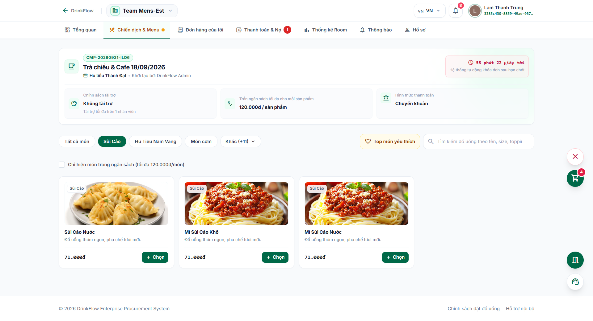

# 3. Đặt món trong chiến dịch gom đơn

<strong>📑 Menu điều hướng</strong> — bấm để chuyển nhanh sang trang khác

- [🏠 Trang chủ / Mục lục](README.md)
- [1. Đăng nhập & Cổng thông tin cá nhân](01-dang-nhap-va-cong-thong-tin.md)
- [2. Tham gia & quản lý Room](02-tham-gia-va-quan-ly-room.md)
- **3. Đặt món trong chiến dịch gom đơn** ← *đang xem*
- [4. Theo dõi đơn hàng](04-theo-doi-don-hang.md)
- [5. Thanh toán & Công nợ](05-thanh-toan-cong-no.md)
- [6. Thống kê chi tiêu](06-thong-ke-chi-tieu.md)
- [7. Hồ sơ cá nhân](07-ho-so-ca-nhan.md)
- [8. Bảo mật & thiết bị đăng nhập](08-bao-mat-thiet-bi.md)
- [9. Thông báo](09-thong-bao.md)
- [10. Đánh giá & góp ý](10-danh-gia-gop-y.md)
- [11. Khi tài khoản bị khoá / hạn chế](11-tai-khoan-bi-khoa.md)
- [12. Đặt món giúp thành viên khác (Order dùm)](12-dat-ho-thanh-vien-khac.md)
- [13. Món trả riêng (không dùng tài trợ)](13-mon-tra-rieng.md)

**Chiến dịch (Campaign)** là một đợt gom đơn cụ thể do Host mở ra trong Room, ví dụ "Trà chiều thứ Sáu" hay "Cơm trưa hôm nay" — có nhà hàng/quán cụ thể, hạn chốt đơn, chính sách trợ giá và menu để chọn món.

## 3.1. Vào menu của chiến dịch

Trong Room, bấm tab **"Chiến dịch & Menu"**.

- Nếu Room **chưa mở** đợt gom đơn nào, trang sẽ hiển thị **"Hiện tại Room chưa mở đợt đặt món"** — quay lại sau hoặc liên hệ Host.
- Nếu đang có chiến dịch mở, bạn sẽ thấy đầy đủ thông tin và menu để chọn món.

Phần đầu trang hiển thị:

- Tên quán, tên chiến dịch, người khởi tạo.
- **Hạn chốt đơn** — hệ thống tự động khoá nhận đơn sau thời điểm này, không thể đặt thêm.
- **Chính sách tài trợ**: mức trợ giá công ty/Room hỗ trợ cho mỗi người (không tài trợ / tài trợ toàn bộ / theo sản phẩm / theo ngân sách).
- **Trần ngân sách tối đa cho mỗi sản phẩm** (nếu có) — món vượt trần sẽ bị cảnh báo khi thêm vào giỏ.
- **Hình thức thanh toán** áp dụng cho chiến dịch (thường là chuyển khoản/VietQR).

## 3.2. Chọn món

1. Dùng ô **tìm kiếm** hoặc các **nút lọc danh mục** (Cà phê, Trà sữa, Freeze & Đá xay, Trà trái cây, Bánh & Snack...) để tìm món nhanh hơn.
2. Có thể bật tick **"Chỉ hiện món trong ngân sách"** để chỉ xem các món nằm trong trần ngân sách cho phép.
3. Bấm vào món muốn đặt — hộp thoại **"Tùy chỉnh món"** hiện ra để bạn chọn:
   - **Kích cỡ (Size)**
   - **Topping thêm**
   - **Lượng đá / Lượng đường** (nếu món hỗ trợ)
   - **Ghi chú đặc biệt** (ví dụ: ít ngọt, không đá, để riêng trân châu...)
   - **Số lượng**
   - **Trả riêng (không dùng tài trợ)** — tick chọn nếu muốn món này không dùng đến chính sách tài trợ của chiến dịch mà ghi thẳng vào công nợ cá nhân của bạn. Xem chi tiết ở [bài 13](13-mon-tra-rieng.md).
4. Bấm **"Thêm vào đơn"** để đưa món vào giỏ hàng.

Muốn xem trước những món được đồng nghiệp chọn nhiều nhất, bấm **"Top món yêu thích"** ở đầu trang menu.

## 3.3. Giỏ hàng và gửi đơn

Bấm nút **"Giỏ hàng"** để mở khung **"Món đã chọn"**, tại đây bạn có thể:

- Sửa số lượng/tuỳ chọn của từng món.
- **Xóa món này** hoặc **Xóa toàn bộ giỏ hàng**.
- Xem **Tạm tính**.

Khi đã chọn xong, bấm **"Xác nhận đơn"**. Hộp thoại xác nhận hiện ra — bấm **"Gửi đơn"** để hoàn tất. Giá hiển thị sẽ luôn được máy chủ kiểm tra lại trước khi ghi nhận đơn, đảm bảo chính xác.

Sau khi gửi đơn thành công, khung tóm tắt phía trên menu sẽ hiển thị món bạn đã chọn kèm liên kết **"Chi tiết đơn"** để xem lại bất cứ lúc nào (xem thêm [bài 4](04-theo-doi-don-hang.md)).

## 3.4. Đặt món giúp đồng nghiệp (đặt hộ)

Bạn có thể đặt món giúp một thành viên khác trong cùng Room (ví dụ đồng nghiệp bận họp):

1. Trong giỏ hàng, ở món muốn đặt hộ, bấm nút **chỉnh sửa / "Chọn người nhận"**.
2. Nhập **mã thành viên, email hoặc số điện thoại** của người đó vào ô tra cứu rồi bấm **"Tra cứu"**.
3. Chọn đúng người và bấm **"Lưu người nhận"** — món đó sẽ được gán cho đồng nghiệp thay vì tính vào đơn của bạn.

Lưu ý: bạn cần có **ít nhất một món cho chính mình** trong giỏ trước khi được phép đặt hộ người khác, và không thể dùng chức năng này để "đặt hộ chính mình". Món đánh dấu **"Trả riêng"** cũng không thể đặt hộ cho người khác. Xem hướng dẫn đầy đủ (bao gồm giới hạn hạn mức nợ của người nhận) tại [bài 12: Đặt món giúp thành viên khác (Order dùm)](12-dat-ho-thanh-vien-khac.md).

## 3.5. Không tham gia / tham gia lại chiến dịch

Nếu không muốn tham gia đợt gom đơn hiện tại, bấm **"Không tham gia"** và xác nhận — giỏ hàng hiện tại (nếu có) sẽ bị xoá. Nếu đổi ý, bấm **"Tham gia lại"** để tiếp tục chọn món (miễn là chiến dịch chưa hết hạn chốt đơn).

## 3.6. Sửa hoặc huỷ đơn đã gửi

Khi chiến dịch còn đang mở nhận đơn, bạn vẫn có thể **"Sửa món"** hoặc **"Hủy đơn"** đối với đơn mình vừa gửi. Sau khi Host đóng chiến dịch hoặc quá hạn chốt đơn, hệ thống sẽ tự động khoá, không cho chỉnh sửa thêm — màn hình hiển thị **"Đã đóng nhận đơn"**.

---

⬅️ [Trang trước: 2. Tham gia & quản lý Room](02-tham-gia-va-quan-ly-room.md) &nbsp;|&nbsp; [🏠 Mục lục](README.md) &nbsp;|&nbsp; [Trang sau: 4. Theo dõi đơn hàng ➡️](04-theo-doi-don-hang.md)
