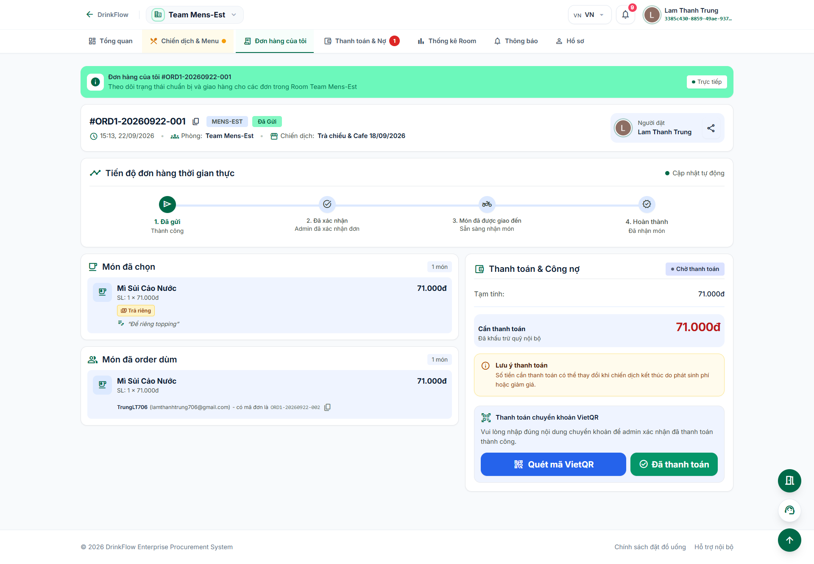
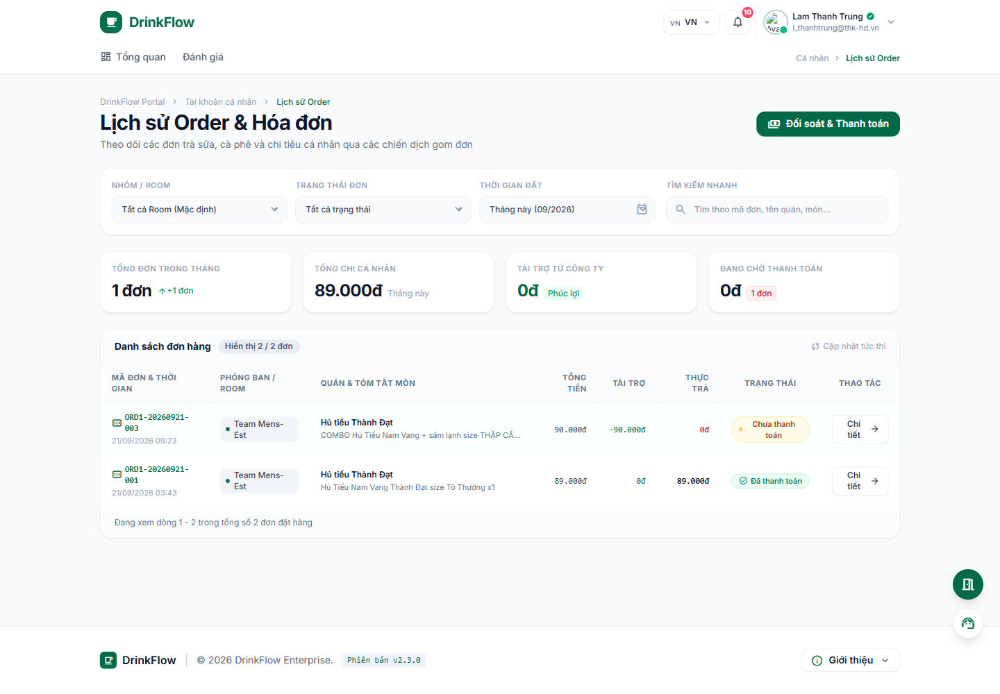

# 4. Theo dõi đơn hàng

<strong>📑 Menu điều hướng</strong> — bấm để chuyển nhanh sang trang khác

- [🏠 Trang chủ / Mục lục](README.md)
- [1. Đăng nhập & Cổng thông tin cá nhân](01-dang-nhap-va-cong-thong-tin.md)
- [2. Tham gia & quản lý Room](02-tham-gia-va-quan-ly-room.md)
- [3. Đặt món trong chiến dịch gom đơn](03-dat-mon-chien-dich.md)
- **4. Theo dõi đơn hàng** ← *đang xem*
- [5. Thanh toán & Công nợ](05-thanh-toan-cong-no.md)
- [6. Thống kê chi tiêu](06-thong-ke-chi-tieu.md)
- [7. Hồ sơ cá nhân](07-ho-so-ca-nhan.md)
- [8. Bảo mật & thiết bị đăng nhập](08-bao-mat-thiet-bi.md)
- [9. Thông báo](09-thong-bao.md)
- [10. Đánh giá & góp ý](10-danh-gia-gop-y.md)
- [11. Khi tài khoản bị khoá / hạn chế](11-tai-khoan-bi-khoa.md)
- [12. Đặt món giúp thành viên khác (Order dùm)](12-dat-ho-thanh-vien-khac.md)
- [13. Món trả riêng (không dùng tài trợ)](13-mon-tra-rieng.md)

## 4.1. Đơn hàng của tôi (trong một Room)

Trong Room, bấm tab **"Đơn hàng của tôi"** để xem toàn bộ đơn bạn đã đặt tại Room đó.

Mỗi đơn hiển thị: mã đơn, thời gian đặt, danh sách món (kèm topping/ghi chú), tạm tính, phần trợ giá từ quỹ Room, phí giao hàng chia sẻ và **số tiền cần thanh toán** cuối cùng. Nếu bạn có đặt hộ đồng nghiệp, đơn cũng liệt kê rõ **"Món đã order dùm"** và người nhận (xem [bài 12](12-dat-ho-thanh-vien-khac.md)). Món nào được đánh dấu **"Trả riêng"** (xem [bài 13](13-mon-tra-rieng.md)) sẽ hiển thị kèm nhãn vàng tương ứng.

**Tiến độ đơn hàng theo thời gian thực** được hiển thị theo 4 bước:

1. **Đã gửi** — đơn đã được ghi nhận thành công.
2. **Đã xác nhận** — Admin/Host đã duyệt đơn.
3. **Món đã được giao đến** — sẵn sàng nhận món.
4. **Hoàn thành** — bạn đã nhận món.

Trạng thái tự động cập nhật, không cần tải lại trang.

## 4.2. Thanh toán ngay trên đơn

Nếu đơn còn ở trạng thái **"Chờ thanh toán"**, bạn có thể:

- Bấm **"Quét mã VietQR"** để mở mã thanh toán chuyển khoản đúng số tiền và đúng nội dung của riêng đơn này.
- Sau khi chuyển khoản xong, bấm **"Đã thanh toán"** → xác nhận trong hộp thoại **"Xác nhận đã thanh toán"** để báo cho Admin Room biết và chờ duyệt gạch nợ (đơn sẽ hiển thị nhãn **"Đang chờ admin duyệt"** trong lúc chờ).

> Nếu đơn được tài trợ 100% hoặc miễn phí, hệ thống sẽ ghi rõ **"Đơn hàng không phát sinh chi phí"** — bạn không cần chuyển khoản.

## 4.3. Lịch sử Order toàn hệ thống (`/me/orders`)

Ngoài xem theo từng Room, bạn có thể xem **gộp tất cả đơn hàng ở mọi Room** tại một chỗ:

1. Vào `/me` → khối "Đơn hàng gần đây" → bấm **"Lịch sử đầy đủ"** (hoặc truy cập trực tiếp `/me/orders`).

Tại trang này bạn có thể:

- **Lọc** theo Room, theo trạng thái (Đã thanh toán / Chờ thanh toán / Đã hủy), theo thời gian (tháng này, tháng trước, 3 tháng gần nhất, tất cả thời gian).
- **Tìm kiếm nhanh** theo mã đơn/tên món.
- Xem nhanh 4 chỉ số: tổng đơn trong tháng, tổng chi cá nhân, tài trợ từ công ty, số đơn đang chờ thanh toán.
- Bấm **"Chi tiết"** trên từng dòng để mở hộp thoại xem đầy đủ: danh sách món, đơn giá, thành tiền, phần tài trợ và số tiền thực trả.

---

⬅️ [Trang trước: 3. Đặt món trong chiến dịch gom đơn](03-dat-mon-chien-dich.md) &nbsp;|&nbsp; [🏠 Mục lục](README.md) &nbsp;|&nbsp; [Trang sau: 5. Thanh toán & Công nợ ➡️](05-thanh-toan-cong-no.md)
