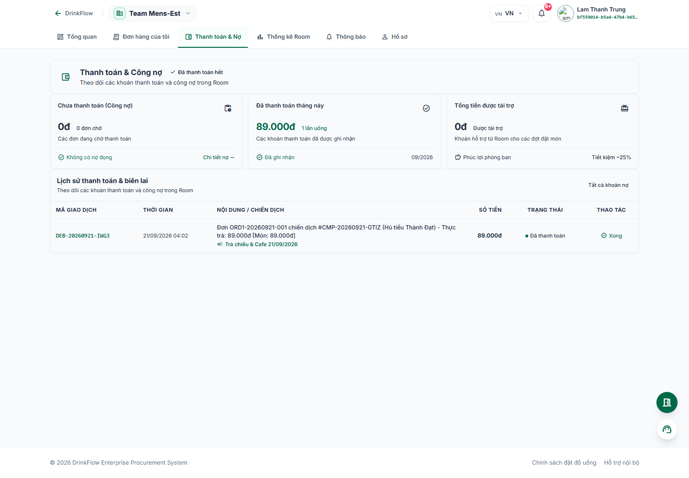
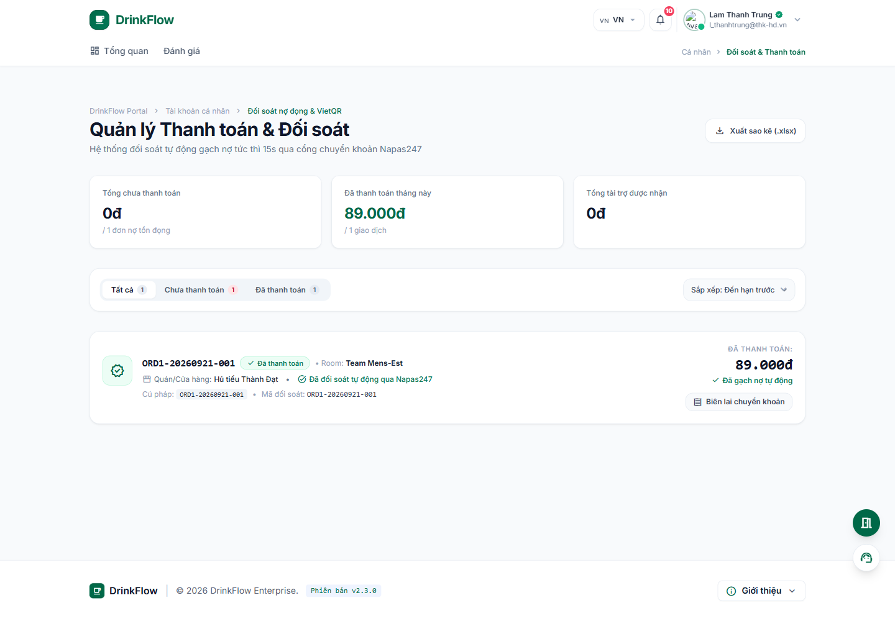

# 5. Thanh toán & Công nợ

<strong>📑 Menu điều hướng</strong> — bấm để chuyển nhanh sang trang khác

- [🏠 Trang chủ / Mục lục](README.md)
- [1. Đăng nhập & Cổng thông tin cá nhân](01-dang-nhap-va-cong-thong-tin.md)
- [2. Tham gia & quản lý Room](02-tham-gia-va-quan-ly-room.md)
- [3. Đặt món trong chiến dịch gom đơn](03-dat-mon-chien-dich.md)
- [4. Theo dõi đơn hàng](04-theo-doi-don-hang.md)
- **5. Thanh toán & Công nợ** ← *đang xem*
- [6. Thống kê chi tiêu](06-thong-ke-chi-tieu.md)
- [7. Hồ sơ cá nhân](07-ho-so-ca-nhan.md)
- [8. Bảo mật & thiết bị đăng nhập](08-bao-mat-thiet-bi.md)
- [9. Thông báo](09-thong-bao.md)
- [10. Đánh giá & góp ý](10-danh-gia-gop-y.md)
- [11. Khi tài khoản bị khoá / hạn chế](11-tai-khoan-bi-khoa.md)

DrinkFlow dùng **VietQR (Napas 247)** để thanh toán/gạch nợ gần như tức thì: bạn quét mã, chuyển khoản đúng nội dung, hệ thống tự động đối soát trong khoảng 15–30 giây mà không cần chờ Host duyệt thủ công (một số Room vẫn cấu hình duyệt thủ công, khi đó đơn sẽ ở trạng thái *"Đang chờ admin duyệt"* cho tới khi Host xác nhận).

## 5.1. Thanh toán & Nợ trong một Room

Trong Room, bấm tab **"Thanh toán & Nợ"**.

Trang chia thành các phần:

- **Chưa thanh toán (Công nợ):** danh sách đơn còn nợ tại Room này, có thể **"Thanh toán toàn bộ"** một lần hoặc thanh toán từng đơn.
- **Đã thanh toán tháng này:** lịch sử các khoản đã gạch nợ thành công.
- **Tổng tiền được tài trợ:** khoản hỗ trợ bạn đã nhận từ quỹ Room.

Với mỗi khoản nợ, bấm **"Quét mã VietQR"** (hoặc **"Xem QR"**) để mở hộp thoại thanh toán, trong đó có sẵn: ngân hàng, số tài khoản, chủ tài khoản, **số tiền chính xác** và **nội dung chuyển khoản** (cú pháp đối soát). Sau khi chuyển khoản xong bấm **"Đã hoàn tất chuyển khoản"**.

> **Quan trọng:** Luôn giữ đúng số tiền và đúng nội dung chuyển khoản hiển thị trên mã QR — sai nội dung có thể khiến hệ thống không tự động gạch nợ được, khi đó hãy dùng nút **"Trợ giúp"** trên trang để liên hệ Quản trị viên Room kèm ảnh chụp giao dịch.

## 5.2. Ví & Thanh toán tổng hợp (`/me/payments`)

Đây là nơi tổng hợp **công nợ từ tất cả các Room** bạn tham gia vào một màn hình duy nhất.

Cách vào: trang **Hồ sơ cá nhân** (`/me/profile`) → mục **"Lối tắt & Quản trị bảo mật"** → **"Lịch sử thanh toán & VietQR"** (hoặc truy cập trực tiếp `/me/payments`).

Các chức năng chính:

- Thẻ **"Tổng chưa thanh toán"**: tổng nợ gộp từ mọi Room, kèm nút **"Thanh toán tất cả qua VietQR"**.
- Thẻ **"Đã thanh toán tháng này"** và **"Tổng tài trợ được nhận"**.
- Tab lọc **Tất cả / Chưa thanh toán / Đã thanh toán**, sắp xếp theo hạn thanh toán hoặc theo giá trị.
- **"Xuất sao kê (.xlsx)"**: tải file Excel chi tiết các giao dịch để đối chiếu hoặc lưu trữ cá nhân.

> Nếu bạn để nợ quá hạn thanh toán ở nhiều Room, tài khoản toàn hệ thống của bạn có thể bị tạm khoá — xem [bài 11](11-tai-khoan-bi-khoa.md).

---

⬅️ [Trang trước: 4. Theo dõi đơn hàng](04-theo-doi-don-hang.md) &nbsp;|&nbsp; [🏠 Mục lục](README.md) &nbsp;|&nbsp; [Trang sau: 6. Thống kê chi tiêu ➡️](06-thong-ke-chi-tieu.md)
