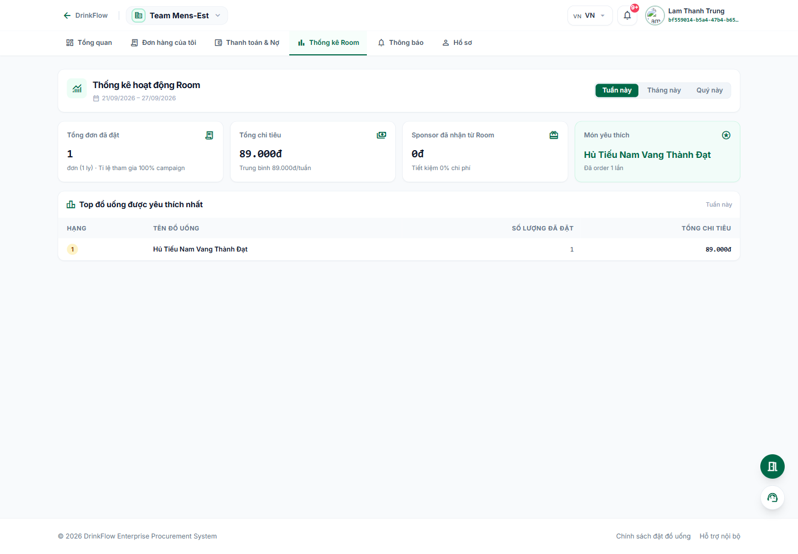
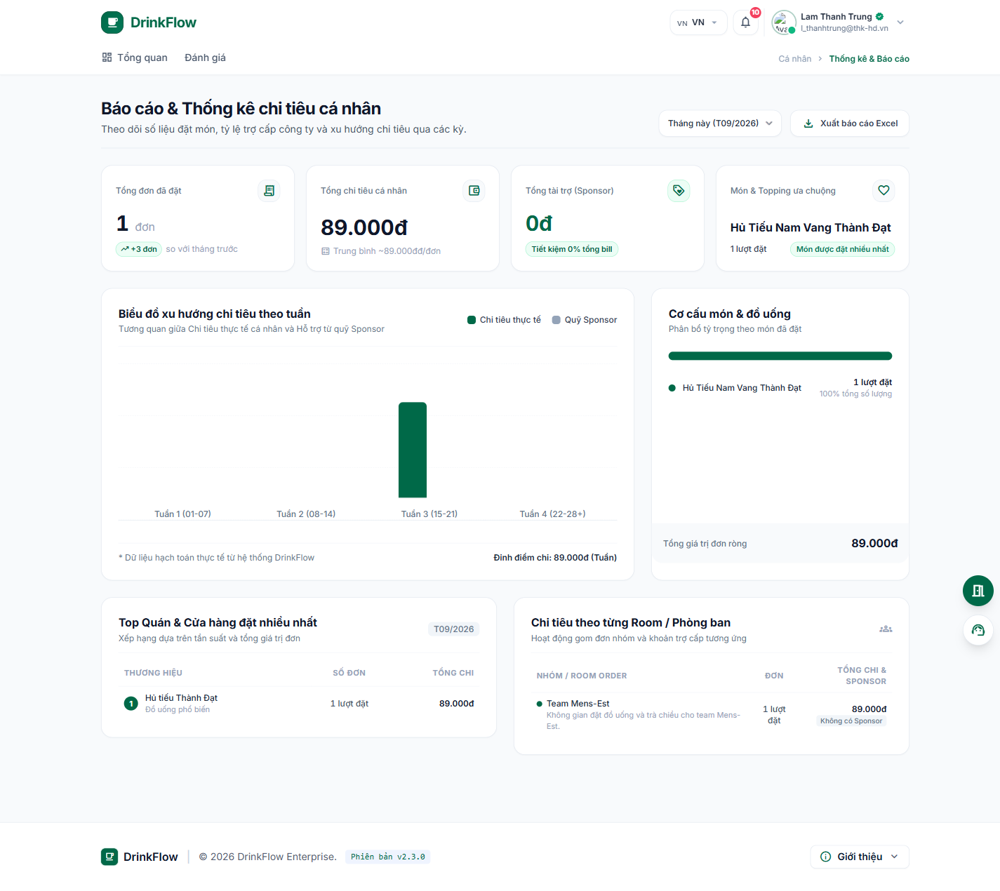

# 6. Thống kê chi tiêu

<strong>📑 Menu điều hướng</strong> — bấm để chuyển nhanh sang trang khác

- [🏠 Trang chủ / Mục lục](README.md)
- [1. Đăng nhập & Cổng thông tin cá nhân](01-dang-nhap-va-cong-thong-tin.md)
- [2. Tham gia & quản lý Room](02-tham-gia-va-quan-ly-room.md)
- [3. Đặt món trong chiến dịch gom đơn](03-dat-mon-chien-dich.md)
- [4. Theo dõi đơn hàng](04-theo-doi-don-hang.md)
- [5. Thanh toán & Công nợ](05-thanh-toan-cong-no.md)
- **6. Thống kê chi tiêu** ← *đang xem*
- [7. Hồ sơ cá nhân](07-ho-so-ca-nhan.md)
- [8. Bảo mật & thiết bị đăng nhập](08-bao-mat-thiet-bi.md)
- [9. Thông báo](09-thong-bao.md)
- [10. Đánh giá & góp ý](10-danh-gia-gop-y.md)
- [11. Khi tài khoản bị khoá / hạn chế](11-tai-khoan-bi-khoa.md)
- [12. Đặt món giúp thành viên khác (Order dùm)](12-dat-ho-thanh-vien-khac.md)
- [13. Món trả riêng (không dùng tài trợ)](13-mon-tra-rieng.md)

## 6.1. Thống kê trong một Room

Trong Room, bấm tab **"Thống kê Room"** để xem báo cáo tiêu thụ của riêng bạn tại Room đó.

Nội dung gồm:

- Bộ lọc khoảng thời gian: **Tuần này / Tháng này / Quý này / Cả năm**.
- Các chỉ số: **Tổng đơn đã đặt** (kèm tỉ lệ tham gia chiến dịch), **Tổng chi tiêu** (trung bình mỗi tuần), **Sponsor đã nhận từ Room**, **Món yêu thích**.
- Bảng **"Top đồ uống được yêu thích nhất"**: xếp hạng, tên món, số lượng đã đặt, tổng chi tiêu cho món đó.
- Nút **"Xuất dữ liệu"** để tải báo cáo.

## 6.2. Thống kê chi tiêu tổng hợp (`/me/statistics`)

Trang này gộp số liệu chi tiêu của bạn **trên toàn bộ các Room**. Vào từ trang **Hồ sơ cá nhân** → **"Thống kê chi tiêu"**, hoặc truy cập trực tiếp `/me/statistics`.

Trang cung cấp góc nhìn đầy đủ hơn:

- 4 chỉ số tổng quan: **Tổng đơn đã đặt**, **Tổng chi tiêu cá nhân**, **Tổng tài trợ (Sponsor)**, **Món & Topping ưa chuộng**.
- **Biểu đồ xu hướng chi tiêu theo tuần**: so sánh chi tiêu thực tế cá nhân với phần được quỹ Sponsor hỗ trợ.
- **Cơ cấu món & đồ uống**: tỷ trọng các loại món bạn hay đặt.
- **Top Quán & Cửa hàng đặt nhiều nhất**.
- **Chi tiêu theo từng Room/phòng ban**: so sánh mức chi tiêu và tài trợ giữa các Room bạn tham gia.
- Chọn khoảng thời gian (tháng này / 3 tháng / 6 tháng / cả năm) và bấm **"Xuất báo cáo Excel"** để tải file chi tiết (bao gồm mã đơn, hóa đơn VietQR, tiền túi và trợ cấp Sponsor).

---

⬅️ [Trang trước: 5. Thanh toán & Công nợ](05-thanh-toan-cong-no.md) &nbsp;|&nbsp; [🏠 Mục lục](README.md) &nbsp;|&nbsp; [Trang sau: 7. Hồ sơ cá nhân ➡️](07-ho-so-ca-nhan.md)
