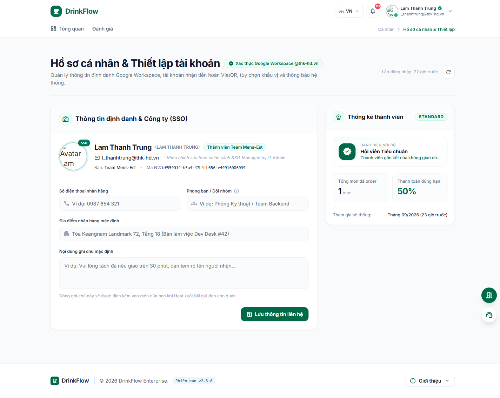
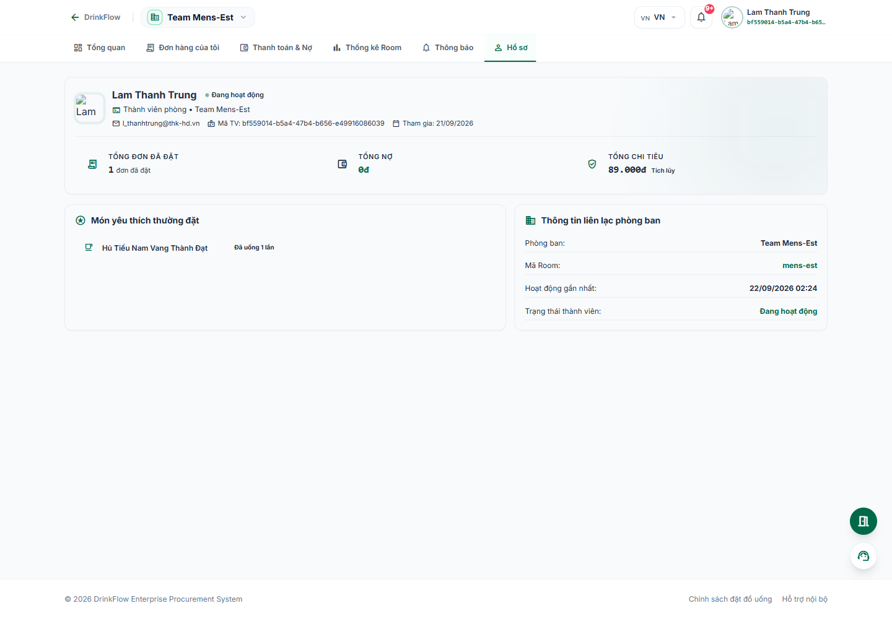

# 7. Hồ sơ cá nhân

<strong>📑 Menu điều hướng</strong> — bấm để chuyển nhanh sang trang khác

- [🏠 Trang chủ / Mục lục](README.md)
- [1. Đăng nhập & Cổng thông tin cá nhân](01-dang-nhap-va-cong-thong-tin.md)
- [2. Tham gia & quản lý Room](02-tham-gia-va-quan-ly-room.md)
- [3. Đặt món trong chiến dịch gom đơn](03-dat-mon-chien-dich.md)
- [4. Theo dõi đơn hàng](04-theo-doi-don-hang.md)
- [5. Thanh toán & Công nợ](05-thanh-toan-cong-no.md)
- [6. Thống kê chi tiêu](06-thong-ke-chi-tieu.md)
- **7. Hồ sơ cá nhân** ← *đang xem*
- [8. Bảo mật & thiết bị đăng nhập](08-bao-mat-thiet-bi.md)
- [9. Thông báo](09-thong-bao.md)
- [10. Đánh giá & góp ý](10-danh-gia-gop-y.md)
- [11. Khi tài khoản bị khoá / hạn chế](11-tai-khoan-bi-khoa.md)

DrinkFlow có **2 loại hồ sơ**: hồ sơ cá nhân dùng chung toàn hệ thống, và hồ sơ riêng của bạn trong từng Room.

## 7.1. Hồ sơ cá nhân & Thiết lập tài khoản (`/me/profile`)

Vào bằng cách bấm avatar góc phải trên cùng → **"Hồ sơ khẩu vị"**, hoặc từ lối tắt **"Thông tin cá nhân"** trên `/me`.

Các khối thông tin:

- **Thông tin định danh & Công ty (SSO):** tên, phòng ban, mã nhân viên — các trường này do quản trị viên IT quản lý, **không chỉnh sửa được** ở đây.
- **Số điện thoại nhận hàng** và **Địa điểm nhận hàng mặc định**: nên điền để Shipper/Host dễ liên hệ và giao đồ uống đúng chỗ. Nhập xong bấm **"Lưu thông tin liên hệ"**.
- **Tài khoản nhận tiền hoàn trả (VietQR):** dùng khi đơn bị quán báo hết món, Host huỷ gom đơn hoặc phát sinh khoản hoàn tiền khuyến mãi — DrinkFlow sẽ tự động hoàn tiền về tài khoản bạn khai báo tại đây. Bấm **"Thiết lập tài khoản ngân hàng"** nếu chưa có, hoặc **"Thay đổi tài khoản"** để cập nhật.
- **Ghi chú mặc định cho quán đồ uống:** nội dung này sẽ tự động đính kèm vào món của bạn mỗi khi Host xuất đơn gửi quán (ví dụ: "tách đá nếu giao trên 30 phút").
- **Kênh nhận thông báo:** bật/tắt thông báo gom đơn mới và âm thanh chuông báo khi có đồ uống tới.
- **Thống kê thành viên & Danh hiệu nội bộ:** tổng số món đã order, tỉ lệ thanh toán đúng hạn, danh hiệu (Hội viên Tiêu chuẩn/Vàng/Kim Cương theo mức độ hoạt động).
- **Lối tắt & Quản trị bảo mật:** liên kết nhanh tới **Bảo mật & thiết bị** ([bài 8](08-bao-mat-thiet-bi.md)) và **Lịch sử thanh toán & VietQR** ([bài 5](05-thanh-toan-cong-no.md)), **Thống kê chi tiêu** ([bài 6](06-thong-ke-chi-tieu.md)).

## 7.2. Hồ sơ thành viên trong một Room

Mỗi Room có một hồ sơ riêng cho bạn, thể hiện hoạt động của bạn **chỉ trong Room đó**. Vào bằng tab **"Hồ sơ"** trong thanh điều hướng của Room.

Nội dung gồm:

- Trạng thái thành viên (Đang hoạt động / Bị chặn / Đã rời phòng), vai trò (Thành viên phòng / Quản trị viên phòng), **mã thành viên (User Code)** và ngày tham gia.
- 4 chỉ số: **Tổng đơn đã đặt**, **Tổng chi tiêu**, **Trợ giá đã nhận**, **Tổng nợ** — tất cả tính riêng cho Room này.
- **Món yêu thích thường đặt** tại Room.
- **Thông tin liên lạc phòng ban** (đồng bộ từ hồ sơ cá nhân) và nút **"Đặt món ngay"** để vào thẳng chiến dịch đang mở (nếu có).

---

⬅️ [Trang trước: 6. Thống kê chi tiêu](06-thong-ke-chi-tieu.md) &nbsp;|&nbsp; [🏠 Mục lục](README.md) &nbsp;|&nbsp; [Trang sau: 8. Bảo mật & thiết bị đăng nhập ➡️](08-bao-mat-thiet-bi.md)
