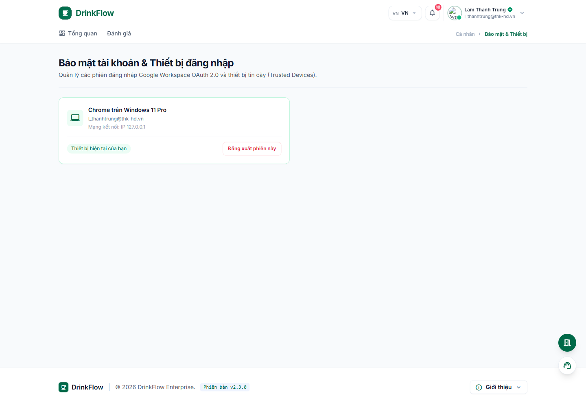

# 8. Bảo mật & thiết bị đăng nhập

<strong>📑 Menu điều hướng</strong> — bấm để chuyển nhanh sang trang khác

- [🏠 Trang chủ / Mục lục](README.md)
- [1. Đăng nhập & Cổng thông tin cá nhân](01-dang-nhap-va-cong-thong-tin.md)
- [2. Tham gia & quản lý Room](02-tham-gia-va-quan-ly-room.md)
- [3. Đặt món trong chiến dịch gom đơn](03-dat-mon-chien-dich.md)
- [4. Theo dõi đơn hàng](04-theo-doi-don-hang.md)
- [5. Thanh toán & Công nợ](05-thanh-toan-cong-no.md)
- [6. Thống kê chi tiêu](06-thong-ke-chi-tieu.md)
- [7. Hồ sơ cá nhân](07-ho-so-ca-nhan.md)
- **8. Bảo mật & thiết bị đăng nhập** ← *đang xem*
- [9. Thông báo](09-thong-bao.md)
- [10. Đánh giá & góp ý](10-danh-gia-gop-y.md)
- [11. Khi tài khoản bị khoá / hạn chế](11-tai-khoan-bi-khoa.md)

Vào trang này bằng cách bấm avatar góc phải → **"Bảo mật & Thiết bị"**, hoặc lối tắt **"Bảo mật & Thiết bị"** trên `/me` (đường dẫn `/me/devices`).

## 8.1. Danh tính & xác thực doanh nghiệp

Vì DrinkFlow dùng đăng nhập Google Workspace (OAuth 2.0), bạn **không cần đặt hay nhớ mật khẩu riêng cho DrinkFlow** — mật khẩu và xác thực đa yếu tố (2FA) do hệ thống Google Workspace của công ty quản lý. Khu vực này chỉ hiển thị thông tin xác thực (mã nhân viên, trạng thái 2FA, chính sách hết hạn token) để bạn nắm được, không có gì cần thao tác thêm.

## 8.2. Thiết bị hiện tại & các phiên đăng nhập khác

- **Thiết bị hiện tại:** hiển thị thiết bị/trình duyệt bạn đang dùng, có đánh dấu **"Thiết bị tin cậy"** nếu được miễn xác thực lại trong 30 ngày.
- **Các phiên đăng nhập & Thiết bị khác:** liệt kê những nơi khác tài khoản của bạn đang đăng nhập (trình duyệt, hệ điều hành, vị trí, hoạt động gần nhất).

Nếu thấy một thiết bị lạ không phải của bạn, bấm **"Đăng xuất phiên này"** ngay trên dòng thiết bị đó để buộc thiết bị đó đăng xuất và phải đăng nhập lại qua Google Workspace SSO.

## 8.3. Đăng xuất khỏi tất cả thiết bị khác

Nếu nghi ngờ có nhiều phiên đăng nhập bất thường hoặc lỡ quên đăng xuất ở máy công cộng:

1. Trong khối **"Thao tác bảo mật khẩn cấp"**, bấm **"Đăng xuất khỏi tất cả thiết bị khác"**.
2. Xác nhận trong hộp thoại — thao tác này sẽ **hủy toàn bộ phiên đăng nhập khác** ngoại trừ thiết bị bạn đang dùng để thực hiện.

## 8.4. Khu vực nguy hiểm — Xoá tài khoản

Ở cuối trang là **"Khu vực nguy hiểm"** với tùy chọn **"Yêu cầu hủy tài khoản"**. Đây là thao tác **không thể hoàn tác**: toàn bộ lịch sử tham gia Room, đơn hàng, dữ liệu thanh toán/công nợ, quyền quản trị và hồ sơ đánh giá của bạn sẽ bị xoá vĩnh viễn khỏi DrinkFlow.

Để xác nhận, bạn phải nhập chính xác **email của mình** hoặc gõ đúng cụm **"XÓA TÀI KHOẢN"** vào ô xác nhận rồi bấm **"Xác nhận xóa toàn bộ dữ liệu"**. Chỉ thực hiện khi bạn thực sự chắc chắn.

---

⬅️ [Trang trước: 7. Hồ sơ cá nhân](07-ho-so-ca-nhan.md) &nbsp;|&nbsp; [🏠 Mục lục](README.md) &nbsp;|&nbsp; [Trang sau: 9. Thông báo ➡️](09-thong-bao.md)
