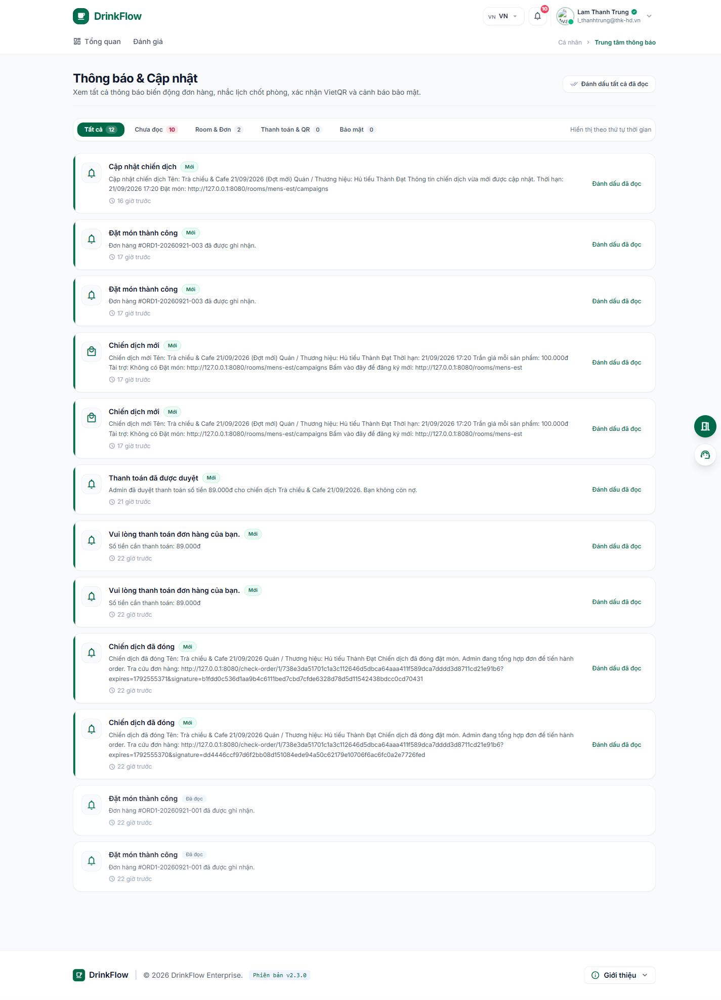
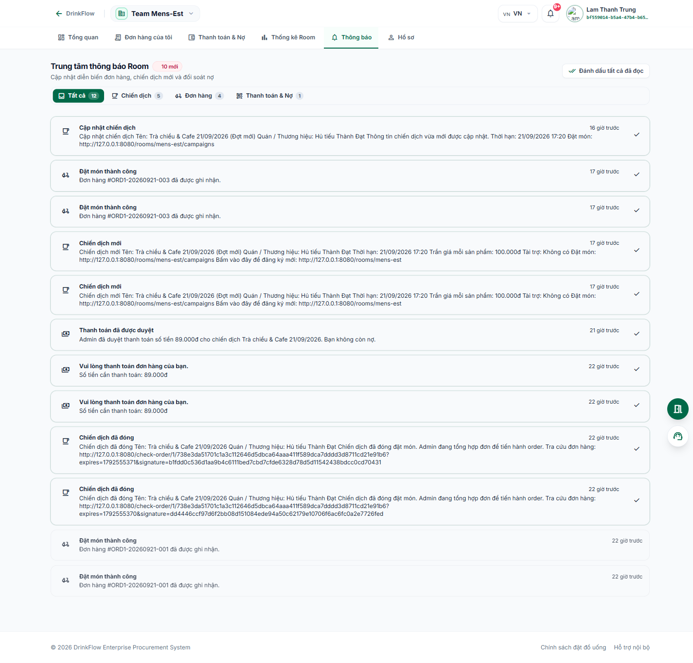

# 9. Thông báo

<strong>📑 Menu điều hướng</strong> — bấm để chuyển nhanh sang trang khác

- [🏠 Trang chủ / Mục lục](README.md)
- [1. Đăng nhập & Cổng thông tin cá nhân](01-dang-nhap-va-cong-thong-tin.md)
- [2. Tham gia & quản lý Room](02-tham-gia-va-quan-ly-room.md)
- [3. Đặt món trong chiến dịch gom đơn](03-dat-mon-chien-dich.md)
- [4. Theo dõi đơn hàng](04-theo-doi-don-hang.md)
- [5. Thanh toán & Công nợ](05-thanh-toan-cong-no.md)
- [6. Thống kê chi tiêu](06-thong-ke-chi-tieu.md)
- [7. Hồ sơ cá nhân](07-ho-so-ca-nhan.md)
- [8. Bảo mật & thiết bị đăng nhập](08-bao-mat-thiet-bi.md)
- **9. Thông báo** ← *đang xem*
- [10. Đánh giá & góp ý](10-danh-gia-gop-y.md)
- [11. Khi tài khoản bị khoá / hạn chế](11-tai-khoan-bi-khoa.md)
- [12. Đặt món giúp thành viên khác (Order dùm)](12-dat-ho-thanh-vien-khac.md)
- [13. Món trả riêng (không dùng tài trợ)](13-mon-tra-rieng.md)

DrinkFlow báo cho bạn biết ngay khi có: đợt gom đơn mới mở, cập nhật trạng thái đơn hàng, xác nhận thanh toán VietQR, hoặc cảnh báo bảo mật — qua 2 lớp: **chuông thông báo nhanh** trên mọi trang, và **trung tâm thông báo** đầy đủ.

## 9.1. Chuông thông báo trên thanh điều hướng

Ở cả Cổng thông tin cá nhân lẫn bên trong từng Room, luôn có biểu tượng 🔔 ở thanh trên cùng, kèm số đếm thông báo chưa đọc. Bấm vào để xem nhanh 5 thông báo mới nhất, có thể:

- Bấm **"Đánh dấu tất cả đã đọc"** ngay trong khung thả xuống.
- Bấm **"Xem tất cả thông báo"** để mở trang đầy đủ.

## 9.2. Trung tâm thông báo toàn hệ thống (`/me/notifications`)

Vào từ chuông thông báo trên `/me`, hoặc lối tắt **"Thông báo"**.

Bạn có thể lọc theo tab: **Tất cả / Chưa đọc / Room & Đơn / Thanh toán & QR / Bảo mật**, và bấm **"Cấu hình thông báo"** để bật/tắt các kênh nhận tin (thông báo mở chiến dịch mới, nhắc nợ và đối soát VietQR).

## 9.3. Thông báo riêng của từng Room

Trong Room, bấm tab **"Thông báo"** để chỉ xem các cập nhật liên quan đến Room đó.

Có thể lọc theo **Tất cả / Đơn hàng / Chiến dịch / Thanh toán & Nợ**, và bấm **"Đánh dấu tất cả đã đọc"** khi đã xem xong.

---

⬅️ [Trang trước: 8. Bảo mật & thiết bị đăng nhập](08-bao-mat-thiet-bi.md) &nbsp;|&nbsp; [🏠 Mục lục](README.md) &nbsp;|&nbsp; [Trang sau: 10. Đánh giá & góp ý ➡️](10-danh-gia-gop-y.md)
