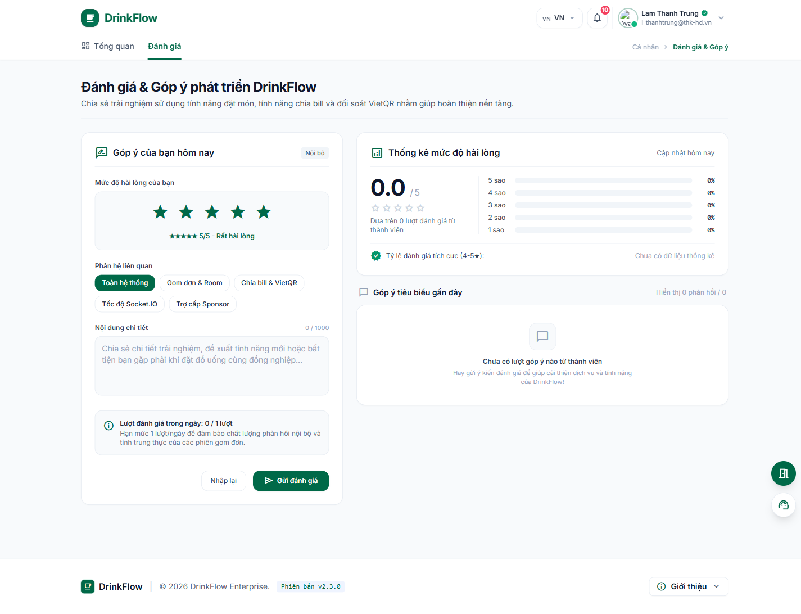

# 10. Đánh giá & góp ý

<strong>📑 Menu điều hướng</strong> — bấm để chuyển nhanh sang trang khác

- [🏠 Trang chủ / Mục lục](README.md)
- [1. Đăng nhập & Cổng thông tin cá nhân](01-dang-nhap-va-cong-thong-tin.md)
- [2. Tham gia & quản lý Room](02-tham-gia-va-quan-ly-room.md)
- [3. Đặt món trong chiến dịch gom đơn](03-dat-mon-chien-dich.md)
- [4. Theo dõi đơn hàng](04-theo-doi-don-hang.md)
- [5. Thanh toán & Công nợ](05-thanh-toan-cong-no.md)
- [6. Thống kê chi tiêu](06-thong-ke-chi-tieu.md)
- [7. Hồ sơ cá nhân](07-ho-so-ca-nhan.md)
- [8. Bảo mật & thiết bị đăng nhập](08-bao-mat-thiet-bi.md)
- [9. Thông báo](09-thong-bao.md)
- **10. Đánh giá & góp ý** ← *đang xem*
- [11. Khi tài khoản bị khoá / hạn chế](11-tai-khoan-bi-khoa.md)

Vào trang **Đánh giá & Góp ý** từ tab **"Đánh giá"** luôn hiển thị trên thanh điều hướng của `/me`, hoặc đường dẫn `/me/feedback`.

## Gửi đánh giá

1. Chọn **mức độ hài lòng** từ 1 đến 5 sao.
2. Chọn **phân hệ liên quan** (Toàn hệ thống, Gom đơn & Room, Chia bill & VietQR, Tốc độ Socket.IO, Trợ cấp Sponsor...).
3. Nhập **nội dung chi tiết**: trải nghiệm, đề xuất tính năng mới hoặc bất tiện bạn gặp phải.
4. Nhập **mã bảo vệ (captcha)** hiển thị trên trang.
5. Bấm **"Gửi đánh giá"**.

> Mỗi tài khoản chỉ được gửi **1 lượt đánh giá/ngày** để đảm bảo chất lượng phản hồi. Nếu đã dùng hết lượt, trang sẽ báo và bạn cần quay lại vào ngày hôm sau.

Sau khi gửi, góp ý của bạn sẽ hiển thị công khai tại khu vực **"Góp ý tiêu biểu gần đây"** sau khi được quản trị viên hệ thống duyệt. Bạn cũng có thể xem **thống kê mức độ hài lòng chung** (tỷ lệ đánh giá tích cực 4–5 sao) của toàn hệ thống ngay trên trang này.

---

⬅️ [Trang trước: 9. Thông báo](09-thong-bao.md) &nbsp;|&nbsp; [🏠 Mục lục](README.md) &nbsp;|&nbsp; [Trang sau: 11. Khi tài khoản bị khoá / hạn chế ➡️](11-tai-khoan-bi-khoa.md)
