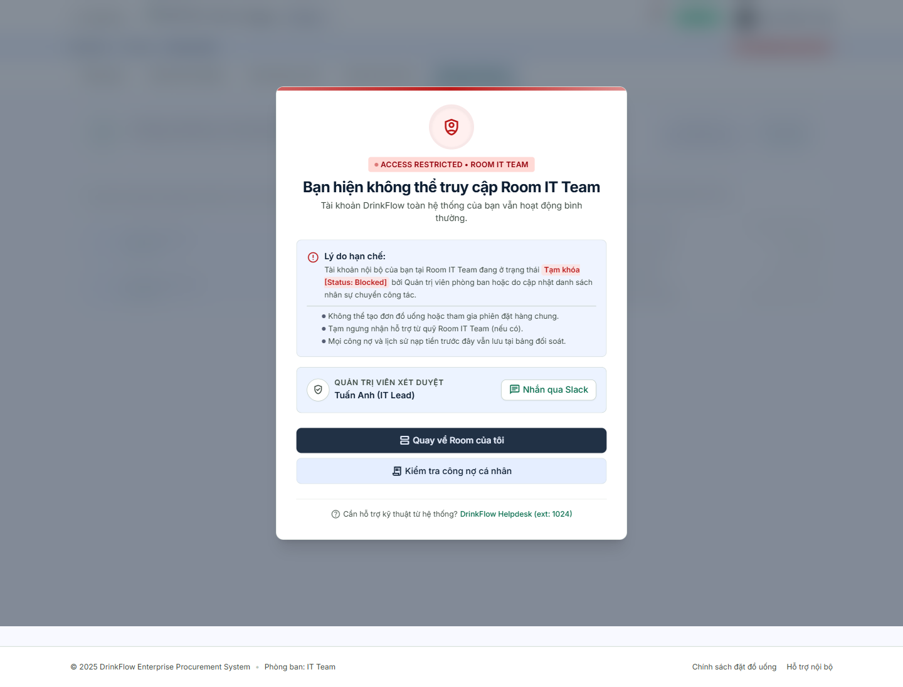
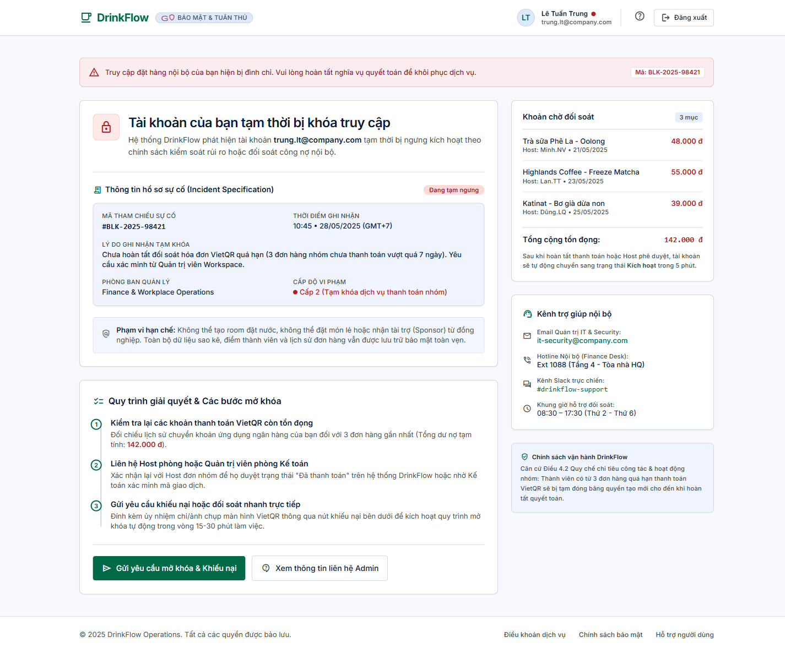

# 11. Khi tài khoản bị khoá / hạn chế

<strong>📑 Menu điều hướng</strong> — bấm để chuyển nhanh sang trang khác

- [🏠 Trang chủ / Mục lục](README.md)
- [1. Đăng nhập & Cổng thông tin cá nhân](01-dang-nhap-va-cong-thong-tin.md)
- [2. Tham gia & quản lý Room](02-tham-gia-va-quan-ly-room.md)
- [3. Đặt món trong chiến dịch gom đơn](03-dat-mon-chien-dich.md)
- [4. Theo dõi đơn hàng](04-theo-doi-don-hang.md)
- [5. Thanh toán & Công nợ](05-thanh-toan-cong-no.md)
- [6. Thống kê chi tiêu](06-thong-ke-chi-tieu.md)
- [7. Hồ sơ cá nhân](07-ho-so-ca-nhan.md)
- [8. Bảo mật & thiết bị đăng nhập](08-bao-mat-thiet-bi.md)
- [9. Thông báo](09-thong-bao.md)
- [10. Đánh giá & góp ý](10-danh-gia-gop-y.md)
- **11. Khi tài khoản bị khoá / hạn chế** ← *đang xem*

DrinkFlow có **2 mức hạn chế truy cập khác nhau** — phân biệt rõ để biết cách xử lý đúng.

## 11.1. Bị hạn chế tại **một Room cụ thể**

Nếu Host tạm khoá bạn tại một Room (thường do chuyển bộ phận hoặc vấn đề công nợ riêng của Room đó), bạn vẫn **đăng nhập và dùng DrinkFlow bình thường ở các Room khác**, chỉ riêng Room này hiển thị trang hạn chế truy cập:

Trang này cho biết: lý do hạn chế, những gì bạn tạm thời không thể làm (tạo đơn, tham gia đặt hàng chung, nhận hỗ trợ từ quỹ Room), và cho phép:

- **"Kiểm tra công nợ cá nhân"** để xem còn khoản nào chưa thanh toán tại Room đó không.
- **"Nhắn qua Slack"** hoặc liên hệ trực tiếp Quản trị viên Room để được xét duyệt mở lại.
- **"Quay về Room của tôi"** để tiếp tục dùng các Room khác trong lúc chờ xử lý.

## 11.2. Tài khoản bị khoá **toàn hệ thống**

Đây là mức nghiêm trọng hơn — áp dụng cho toàn bộ tài khoản DrinkFlow của bạn ở mọi Room, thường do còn nợ quá hạn chưa đối soát ở một hoặc nhiều Room. Khi bị khoá, mọi trang trong hệ thống sẽ tự động chuyển bạn về trang **"Tài khoản của bạn tạm thời bị khóa truy cập"**.

Trang này cung cấp:

- **Thông tin sự cố**: mã tham chiếu, thời điểm ghi nhận, lý do tạm khoá, cấp độ vi phạm.
- **Quy trình mở khoá gồm 3 bước**: (1) kiểm tra lại các khoản VietQR còn tồn đọng, (2) liên hệ Host phòng hoặc Kế toán để xác nhận đã thanh toán, (3) gửi yêu cầu khiếu nại nếu bạn tin rằng đã thanh toán nhưng hệ thống chưa ghi nhận.

### Gửi yêu cầu mở khoá / khiếu nại

1. Bấm **"Gửi yêu cầu mở khóa & Khiếu nại"**.
2. Điền **lý do/ghi chú giải trình** (ví dụ: đã chuyển khoản lúc mấy giờ, qua ngân hàng nào) và **mã tham chiếu giao dịch hoặc số điện thoại liên hệ**.
3. Bấm **"Gửi yêu cầu"**.

Yêu cầu sẽ được gửi tới bộ phận Tài chính & IT Admin, thời gian xử lý dự kiến 15–30 phút làm việc. Sau khi hoàn tất thanh toán hoặc được Host phê duyệt, tài khoản sẽ tự động kích hoạt lại trong vòng 5 phút.

Nếu cần hỗ trợ thêm, bấm **"Xem thông tin liên hệ Admin"** để lấy email Đội ngũ IT Security & Admin và hotline Bộ phận Kế toán.

---

⬅️ [Trang trước: 10. Đánh giá & góp ý](10-danh-gia-gop-y.md) &nbsp;|&nbsp; [🏠 Quay lại Mục lục](README.md)
