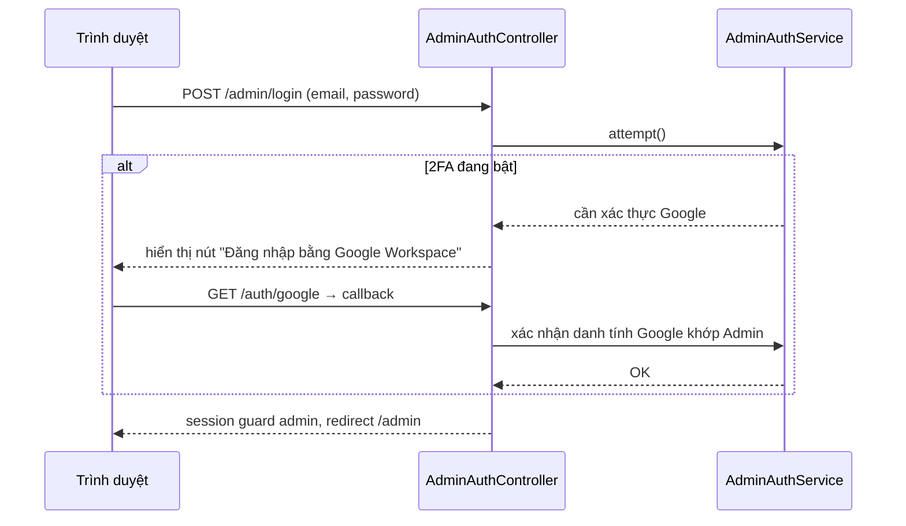

# 1. Xác thực & Phân quyền

[← Về Tổng quan nghiệp vụ](overview.md)

DrinkFlow có **hai hệ thống xác thực độc lập** dùng chung một database nhưng khác guard Laravel: guard `web` cho Global User, guard `admin` cho Admin/Superadmin.

## 1.1. Global User — Google Workspace SSO

- Đăng nhập qua OAuth 2.0 (`GoogleAuthController`), không lưu mật khẩu.
- `GlobalUserStatus`: `Active` → `Blocked` (nợ quá hạn hoặc vi phạm) → có thể `Disabled` (tự xoá tài khoản).
- Middleware `ResolveGlobalUser` (`global.user`) resolve user từ session **hoặc** cookie thiết bị tin cậy (`drinkflow_device_uuid` + `drinkflow_trusted_token`), tự động đăng xuất nếu thiết bị đã bị thu hồi (xem [bài 10](10-bao-mat-thiet-bi-audit.md)).
- Tài khoản `Blocked` chỉ được phép truy cập `/blocked`, `/blocked/appeal`, `/logout` — mọi route khác bị chặn (403 JSON hoặc redirect).

## 1.2. Admin/Superadmin — Email + Mật khẩu + 2FA tuỳ chọn

- Đăng nhập qua `AdminAuthService` (guard `admin`), có OTP quên mật khẩu (15 phút hiệu lực) và 2FA tuỳ chọn bật qua Google Workspace re-auth.
- `AdminStatus`: `Active` (ngầm định) → `Inactive` / `Suspended`.
- `AdminRole`: `Admin` (giới hạn theo Room được gán) hoặc `SuperAdmin` (không giới hạn Room, middleware `superadmin` thêm một lớp kiểm tra trên middleware `admin`).

## 1.3. Phân quyền theo Room (Admin ↔ Room)

Middleware `admin.room` kiểm tra Admin đang truy cập một Room nằm trong danh sách được phân quyền (bảng quan hệ nhiều-nhiều Admin↔Room, quản lý bởi Superadmin — xem [bài 11](11-quan-tri-he-thong-superadmin.md)). Admin **không thể** truy cập Room ngoài danh sách này dù biết slug/URL.

## 1.4. Bảng so sánh ranh giới quyền hạn

| Hành động | Global User | Admin | Superadmin |
| --- | :-: | :-: | :-: |
| Đặt món, xem đơn của mình | ✅ | — | — |
| Quản lý chiến dịch/đơn/nợ của Room được gán | — | ✅ | ✅ (mọi Room) |
| Tạo/xoá Room, gán Admin cho Room | — | — | ✅ |
| Khoá tài khoản Global User toàn hệ thống | — | — | ✅ |
| Duyệt Feedback công khai, quản lý Version | — | — | ✅ |
| Xem Audit Log / Security Event toàn hệ thống | — | — | ✅ |

## Tham chiếu mã nguồn

`App\Enums\GlobalUserStatus`, `App\Enums\AdminStatus`, `App\Enums\AdminRole` · `App\Http\Middleware\ResolveGlobalUser`, `EnsureAdminRoomAccess` · `App\Services\Auth\AdminAuthService`, `DeviceTrustService` · `routes/user.php`, `routes/admin.php`, `routes/superadmin.php`.
