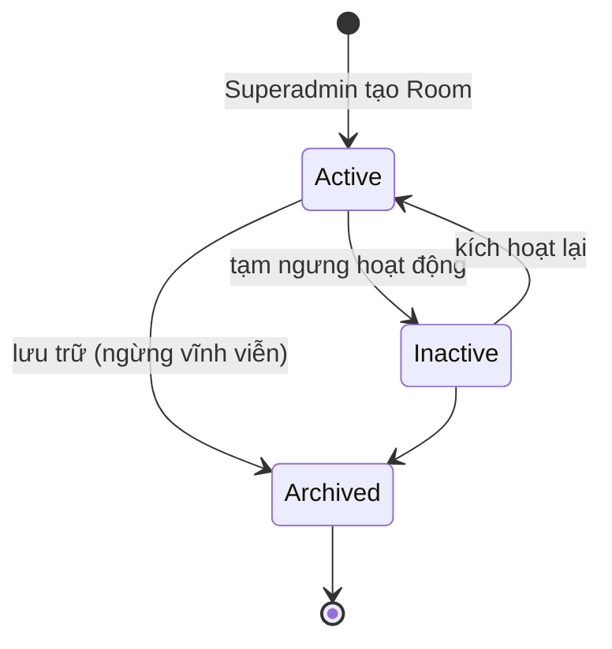
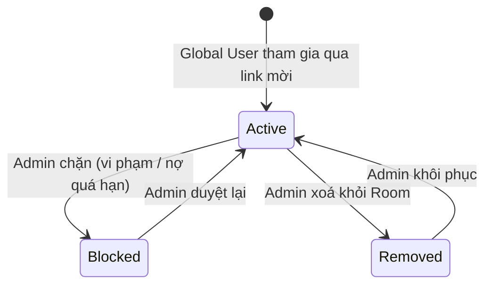
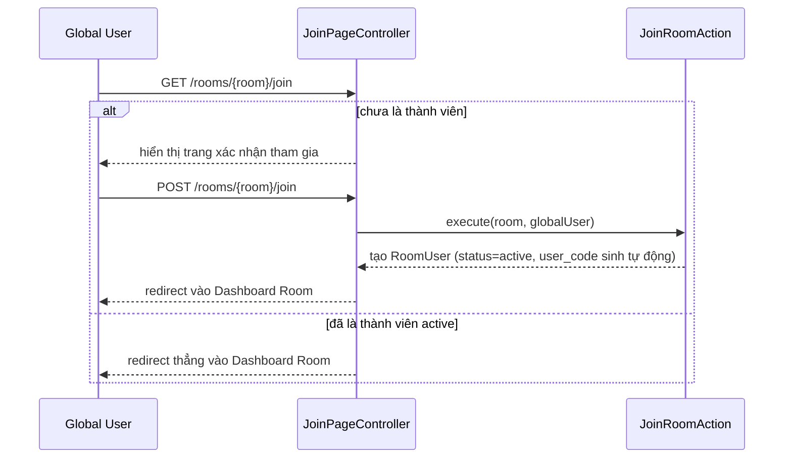

# 2. Quản lý Room & Thành viên

[← Về Tổng quan nghiệp vụ](overview.md)

**Room** là đơn vị tổ chức trung tâm của DrinkFlow — mỗi phòng ban/nhóm là một Room độc lập với thành viên, chiến dịch, công nợ và cấu hình riêng.

## 2.1. Vòng đời Room

Chỉ **Superadmin** tạo/đổi trạng thái Room ([bài 11](11-quan-tri-he-thong-superadmin.md)); Admin chỉ vận hành bên trong Room đã được gán, không tạo Room mới được.

## 2.2. Vòng đời thành viên (RoomUser)

Điểm quan trọng: **`RoomUserStatus` hoàn toàn độc lập với `GlobalUserStatus`** — bị `Blocked` tại 1 Room không ảnh hưởng quyền truy cập các Room khác hay Cổng thông tin cá nhân `/me` của Global User đó (`JoinRoomAction`, `SetRoomUserStatusAction`).

## 2.3. Luồng tham gia Room

Mỗi `RoomUser` được cấp một **`user_code`** ngẫu nhiên — dùng làm định danh tra cứu khi đặt hộ ([bài 4](04-dat-mon-gio-hang.md)) và hiển thị trong bảng đối soát thay vì lộ email.

## 2.4. Thiết bị tin cậy (Device Trust)

Mỗi lần đăng nhập trên thiết bị mới có thể tạo một bản ghi `RoomUserDevice` gắn với `RoomUser` cụ thể (không phải Global User) — cho phép bỏ qua xác thực lại trong một khoảng thời gian. Admin có thể **thu hồi** từng thiết bị (`admin.room-user-devices.revoke`) khi nghi ngờ mất máy — xem chi tiết ở [bài 10](10-bao-mat-thiet-bi-audit.md).

## Tham chiếu mã nguồn

`App\Models\Room`, `App\Models\RoomUser`, `App\Models\RoomUserDevice` · `App\Enums\RoomStatus`, `RoomUserStatus` · `App\Actions\User\JoinRoomAction`, `SetRoomUserStatusAction`, `RestoreRoomUserAction`, `AdminAddRoomUserAction` · `App\Events\RoomMembershipUpdated`.
