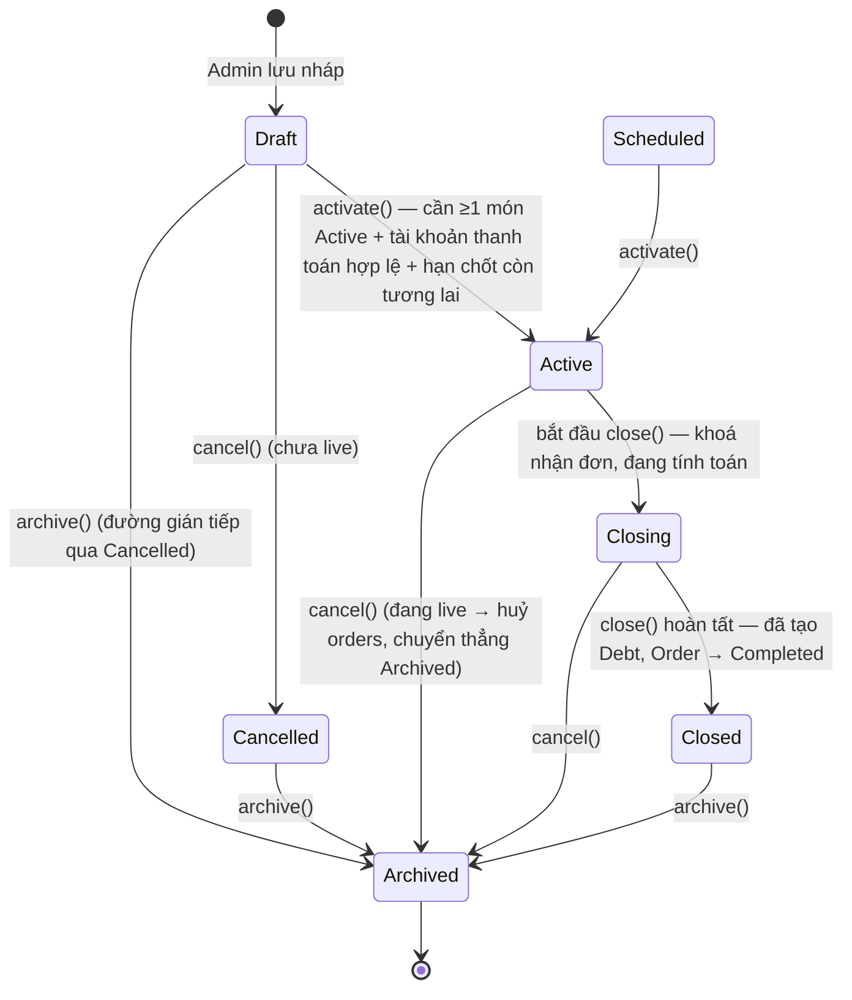
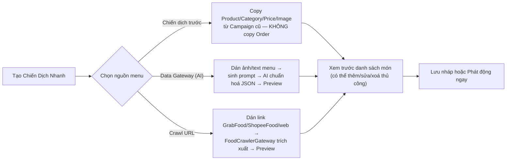

# 3. Chiến dịch gom đơn (Campaign)

[← Về Tổng quan nghiệp vụ](overview.md)

**Campaign** là trung tâm nghiệp vụ của DrinkFlow: một đợt gom đơn cụ thể gắn với một quán, một menu, một hạn chốt đơn và một chính sách tài trợ.

## 3.1. Vòng đời chiến dịch (`CampaignStatus`)

> **Lưu ý quan trọng**: khi `cancel()` một chiến dịch **đang live** (`Active`/`Scheduled`/`Closing`), toàn bộ Order chưa huỷ sẽ bị chuyển sang `Cancelled` và campaign đi thẳng sang `Archived` — **không** qua `Cancelled` như khi huỷ một bản `Draft` (`TransitionCampaignAction::cancel`).

## 3.2. Ba nguồn nạp menu khi tạo nhanh

Dù chọn nguồn nào, Admin luôn có thể **thêm món thủ công** (tên, giá, ảnh, mô tả, topping, size) trước khi publish — không có màn hình quản trị "Sản phẩm" độc lập, dữ liệu món chỉ tồn tại trong phạm vi từng Campaign (`CreateCampaignAction`, `ImportCampaignItemsAction`, `CrawlerController`, `DataGatewayController`).

## 3.3. Trạng thái từng món trong menu (`CampaignItemStatus`)

`Active` (đang bán) → `SoldOut` (hết hàng tạm thời, vẫn hiện nhưng không đặt được) → `Inactive` (ẩn khỏi menu). Admin đổi trạng thái từng món hoặc hàng loạt (`toggleItemStatus`, `batchUpdateItemStatus`).

## 3.4. Theo dõi mức độ tham gia (`CampaignParticipant`)

Song song với Order, hệ thống theo dõi trạng thái tham gia của **từng thành viên** với từng chiến dịch để tính "Final Summary" chính xác — xem chi tiết công thức ở [bài 4](04-dat-mon-gio-hang.md).

## 3.5. Các hành động vòng đời khác (không đổi `status`)

| Hành động | Action class | Ghi chú |
| --- | --- | --- |
| Gia hạn deadline | `ExtendCampaignDeadlineAction` | Chỉ cộng thêm phút vào `deadline`, các mốc cố định `[10, 20, 30, 60]` phút |
| Đánh dấu đang giao | `MarkCampaignDeliveringAction` | Bắn `CampaignDelivering` event, không đổi `status` |
| Gửi lại thông báo | `ResendCampaignNotificationAction` | Bắn lại `CampaignCreated`-style notification |
| Nhân bản | `DuplicateCampaignAction` | Tạo bản `Draft` mới sao chép cấu hình |
| Chia lại hoá đơn | `SplitCampaignBillAction` | Áp dụng `BillSplitMethod` khi cần chia lại phí ship/giảm giá sau khi đã có Order |

## Tham chiếu mã nguồn

`App\Models\Campaign`, `CampaignItem`, `CampaignParticipant` · `App\Enums\CampaignStatus`, `CampaignItemStatus` · `App\Actions\Campaign\*` (14 action) · `App\Events\CampaignCreated/Updated/Closed/Cancelled/Delivering` · Xem thao tác UI ở [Hướng dẫn Admin – bài 4](../guildes/admin/04-quan-ly-chien-dich.md).
