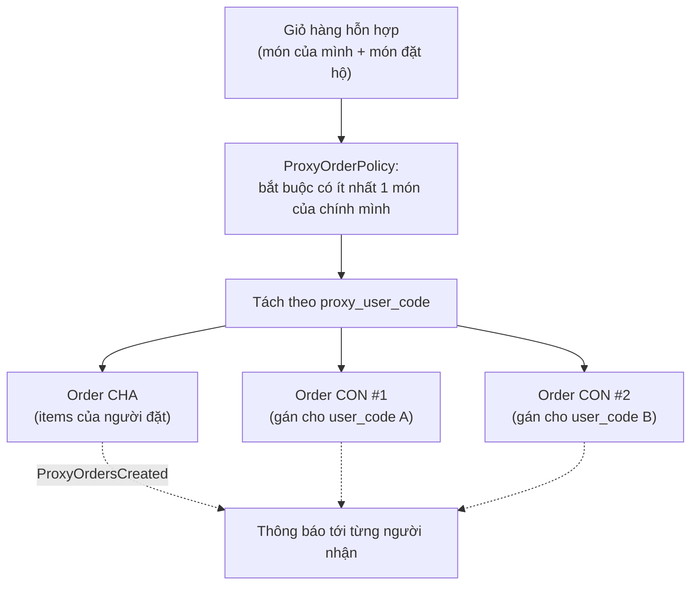
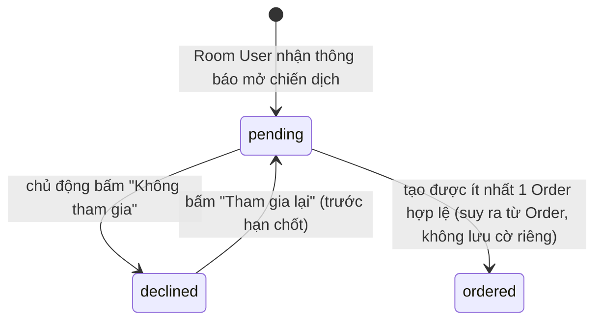

# 4. Đặt món & Giỏ hàng

[← Về Tổng quan nghiệp vụ](overview.md)

Nghiệp vụ đặt món thuộc phía **Global User/Room User**, xử lý tại `CreateOrderAction` (đặt cho chính mình) và `CreateProxyOrdersAction` (đặt kèm đặt hộ đồng nghiệp).

## 4.1. Điều kiện để tạo được Order

`CreateOrderAction::execute()` kiểm tra tuần tự:

1. Campaign thuộc đúng Room của Room User (`campaign.room_id === roomUser.room_id`).
2. Campaign đang **"orderable"** (thường là `Active` và chưa quá `deadline`).
3. `RoomUser.status === Active` **và** `GlobalUser.status === Active` — bị chặn ở 1 trong 2 cấp đều không đặt được.
4. Danh sách `items` hợp lệ (không rỗng, trừ trường hợp tạo Order rỗng làm Parent cho đặt hộ).

Toàn bộ được bọc trong `DB::transaction` với `lockForUpdate()` trên Campaign và Room để tránh race-condition khi nhiều người đặt cùng lúc (đặc biệt quan trọng với đánh số thứ tự đơn hàng theo ngày).

## 4.2. Đặt hộ (Proxy Order) — mô hình Parent/Child

Mỗi người nhận (`proxy_user_code`) phải là một `RoomUser` **đang hoạt động** trong cùng Room; không cho phép tự đặt hộ chính mình. Mỗi nhóm món theo mã người nhận trở thành **một Order con độc lập** đứng tên người nhận đó — không gộp chung vào Order của người đặt.

## 4.3. Theo dõi mức độ tham gia (`CampaignParticipant`)

Đây là bảng phụ trợ giúp "Final Summary" khi đóng chiến dịch chính xác, tách biệt với việc có Order hay không:

> Chỉ 2 trạng thái được lưu tường minh trong CSDL: `pending` và `declined` (`CampaignParticipant::STATUS_PENDING`, `STATUS_DECLINED`). Trạng thái **"đã đặt" (ordered) là suy luận** từ việc Room User đó có Order thuộc campaign, không phải một giá trị `status` riêng — và **"chưa phản hồi" (No Action/Unresponsive)** là phần bù: đã nhận thông báo nhưng không `declined` và không có Order.

## 4.4. Tuỳ chỉnh món & Giỏ hàng phía client

Giỏ hàng (size, topping, số lượng, ghi chú) được giữ ở phía client cho tới khi checkout; server chỉ nhận payload cuối và **luôn tính lại giá từ `CampaignItem`/`CampaignItemSize`/`CampaignItemTopping` trong CSDL** — không tin tưởng giá client gửi lên, chống gian lận giá.

## Tham chiếu mã nguồn

`App\Actions\Order\CreateOrderAction`, `CreateProxyOrdersAction` · `App\Services\Order\ProxyOrderPolicy` · `App\Models\CampaignParticipant` · `App\Actions\Campaign\DeclineCampaignAction`, `RejoinCampaignAction` · `App\Events\OrderCreated`, `ProxyOrdersCreated` · Xem thao tác UI ở [Hướng dẫn User – bài 3](../guildes/user/03-dat-mon-chien-dich.md).
