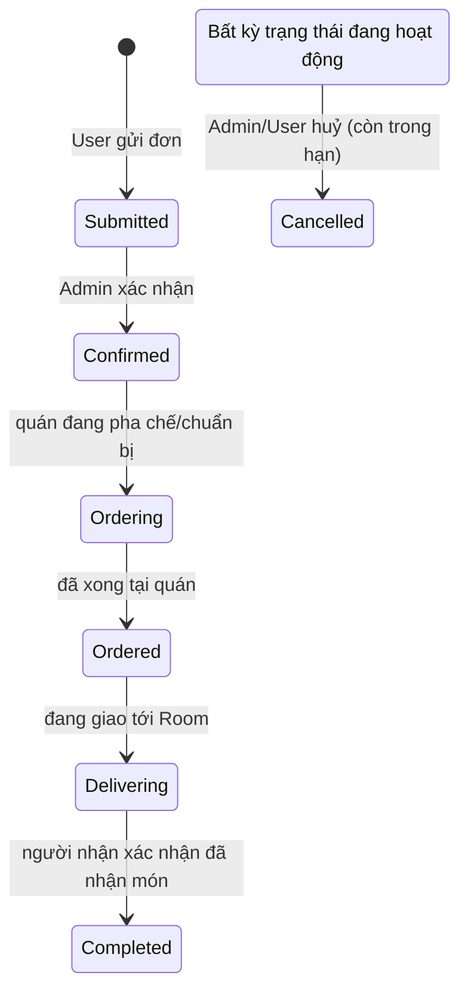
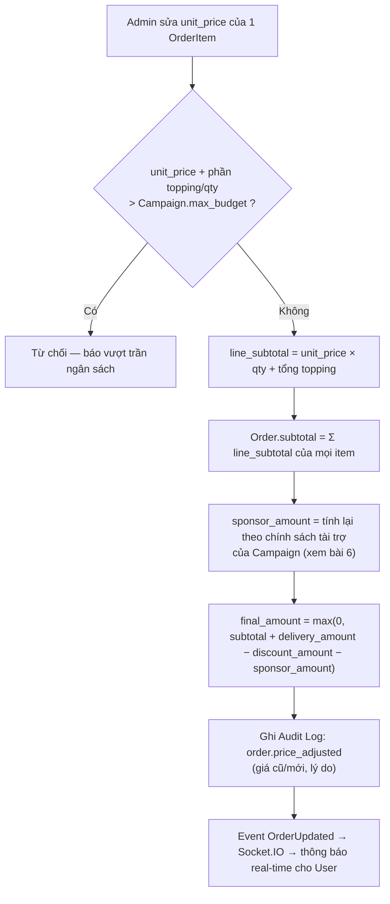

# 5. Vận hành đơn hàng (Order)

[← Về Tổng quan nghiệp vụ](overview.md)

## 5.1. Vòng đời trạng thái (`OrderStatus`)

`isActive()` coi 5 trạng thái đầu (`Submitted…Delivering`) là **"đang hoạt động"**; `Completed` và `Cancelled` là trạng thái cuối (terminal). Khi [đóng chiến dịch](03-chien-dich-gom-don.md#31-vòng-đời-chiến-dịch-campaignstatus), toàn bộ Order đang hoạt động bị chuyển thẳng sang `Completed`.

## 5.2. Sửa/khoá đơn

`UpdateOrderAction` chỉ cho sửa khi Order **đang hoạt động và chưa Cancelled** (`order.status->isActive()`); Order đã `Completed`/`Cancelled` bị khoá, cần Admin bấm **"Mở khoá đơn"** (`unlock`) mới sửa lại được — dùng khi cần chỉnh sau khi chiến dịch đã đóng.

## 5.3. Điều chỉnh giá thực tế — công thức tính lại

Server **luôn** tính lại `subtotal`/`sponsor_amount`/`final_amount` từ dữ liệu gốc — Admin chỉ được sửa `unit_price` từng dòng, không được ghi đè trực tiếp các trường tổng hợp, đảm bảo không lệch sổ sách.

## 5.4. Xử lý hàng loạt

`bulkStatus` và `bulkCancel` (Admin) áp dụng cùng `UpdateOrderStatusAction` cho nhiều Order được chọn trong 1 transaction, kèm ghi `AuditService` cho từng thay đổi.

## Tham chiếu mã nguồn

`App\Models\Order`, `OrderItem`, `OrderItemTopping` · `App\Enums\OrderStatus` · `App\Actions\Order\UpdateOrderAction`, `UpdateOrderStatusAction`, `DeleteOrderAction`, `ConfirmOrderPaymentAction` · `App\Events\OrderCreated/Updated/Deleted` · Xem thao tác UI ở [Hướng dẫn Admin – bài 5](../guildes/admin/05-quan-ly-don-hang.md) và [Hướng dẫn User – bài 4](../guildes/user/04-theo-doi-don-hang.md).
