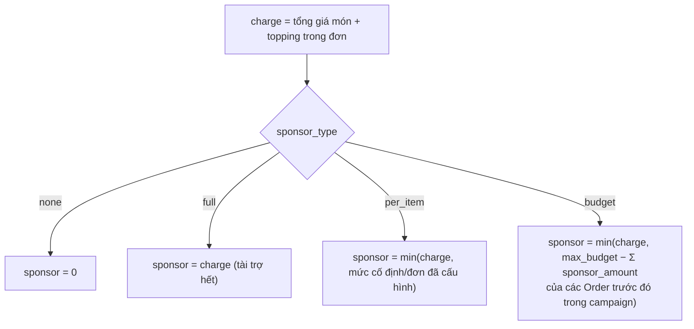

# 6. Chính sách Tài trợ (Sponsor)

[← Về Tổng quan nghiệp vụ](overview.md)

Model `Campaign` định nghĩa **4 kiểu tài trợ** (`Campaign::SPONSOR_TYPE_*`), áp dụng để bù một phần/toàn bộ chi phí đặt món cho thành viên.

| Hằng số | Giá trị | Ý nghĩa |
| --- | --- | --- |
| `SPONSOR_TYPE_NONE` | `none` | Không tài trợ |
| `SPONSOR_TYPE_FULL` | `full` | Tài trợ 100% — có thể chỉ định nhiều Sponsor chia theo % |
| `SPONSOR_TYPE_PER_ITEM` | `per_item` | Trợ giá cố định trên mỗi đơn (ví dụ "hỗ trợ tối đa 20.000đ/đơn") |
| `SPONSOR_TYPE_BUDGET` | `budget` | Trích từ **một quỹ chung có hạn mức**, ai đặt trước dùng trước |

> **Ghi chú kỹ thuật**: màn hình **"Tạo Chiến Dịch Nhanh"** hiện tại của Admin chỉ có 2 lựa chọn khả dụng trong dropdown là *Không tài trợ* và *Tài trợ toàn bộ* (xem [Hướng dẫn Admin – bài 4](../guildes/admin/04-quan-ly-chien-dich.md#43-chính-sách-tài-trợ-sponsor)); `per_item` và `budget` **có logic tính toán đầy đủ ở tầng backend** (`CreateOrderAction`) nhưng chưa có UI để Admin chọn trực tiếp trong luồng tạo nhanh — cần xác nhận với đội phát triển UI/API nào đang set 2 giá trị này trước khi coi là tính năng "đã hoàn thiện end-to-end".

## 6.1. Công thức tính sponsor **lúc đặt món** (`CreateOrderAction`)



Với `budget`, quỹ là **dùng chung theo thứ tự đặt món** — thành viên đặt sau khi quỹ đã cạn sẽ không còn được trợ giá (`sponsor = 0` khi phần dư ≤ 0).

## 6.2. Công thức quyết toán **lúc đóng chiến dịch** (`CloseCampaignAction`)

Khi tài trợ **toàn bộ (Full) với danh sách Sponsor theo %** — nợ được ghi cho **Sponsor**, không phải cho từng người đặt món:

```
netCampaignTotal = max(0, Σsubtotal + delivery_fee − discount)
sponsorAmount[i] = round(netCampaignTotal × percentage[i] / 100)
```
Sai số làm tròn dồn vào Sponsor đầu tiên trong danh sách. Mọi Order trong campaign được set `final_amount = 0` (người đặt không phải trả).

Khi **không tài trợ hoặc tài trợ một phần** — nợ được ghi cho **từng thành viên**, theo tỉ lệ đóng góp vào tổng đơn:

```
ratio[user]        = subtotal[user] / grossSubtotal
deliveryFee[user]  = round(delivery_fee × ratio[user])
discount[user]     = round(discount × ratio[user])
finalAmount[user]  = max(0, subtotal[user] + deliveryFee[user] − discount[user] − sponsorAmount[user])
```
`sponsorAmount[user]` ở công thức này là **tổng đã cộng dồn từ lúc đặt món** (mục 6.1), không tính lại theo rule mới — nghĩa là thay đổi chính sách tài trợ sau khi thành viên đã đặt **không** hồi tố cho các đơn cũ.

## 6.3. Bảng quyết định: ai bị ghi nợ?

| Chính sách | Ai nợ? | Khi nào phát sinh |
| --- | --- | --- |
| `none` | Từng thành viên (100% giá trị đơn) | Lúc đóng chiến dịch |
| `full` | Sponsor (theo % cam kết) | Lúc đóng chiến dịch |
| `per_item` / `budget` | Từng thành viên (phần chưa được trợ giá) | Lúc đóng chiến dịch, dựa trên `sponsor_amount` đã chốt từ lúc đặt món |

## Tham chiếu mã nguồn

`App\Models\Campaign` (hằng số `SPONSOR_TYPE_*`, cột `sponsor_allocations`) · `App\Actions\Order\CreateOrderAction::recalculateSponsor` (đặt tên nội bộ tương tự nhưng khác class với `UpdateOrderAction`) · `App\Actions\Campaign\CloseCampaignAction` · Xem thêm hệ quả công nợ ở [bài 7](07-thanh-toan-cong-no.md).
