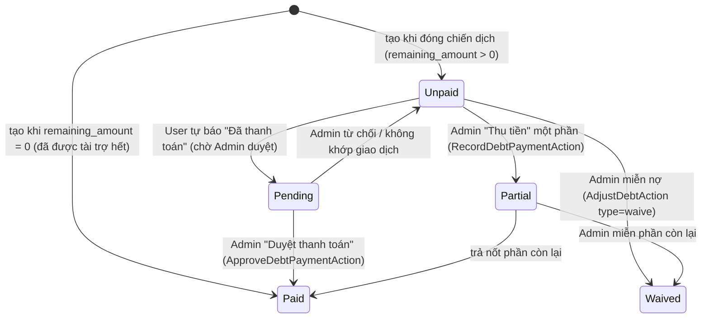
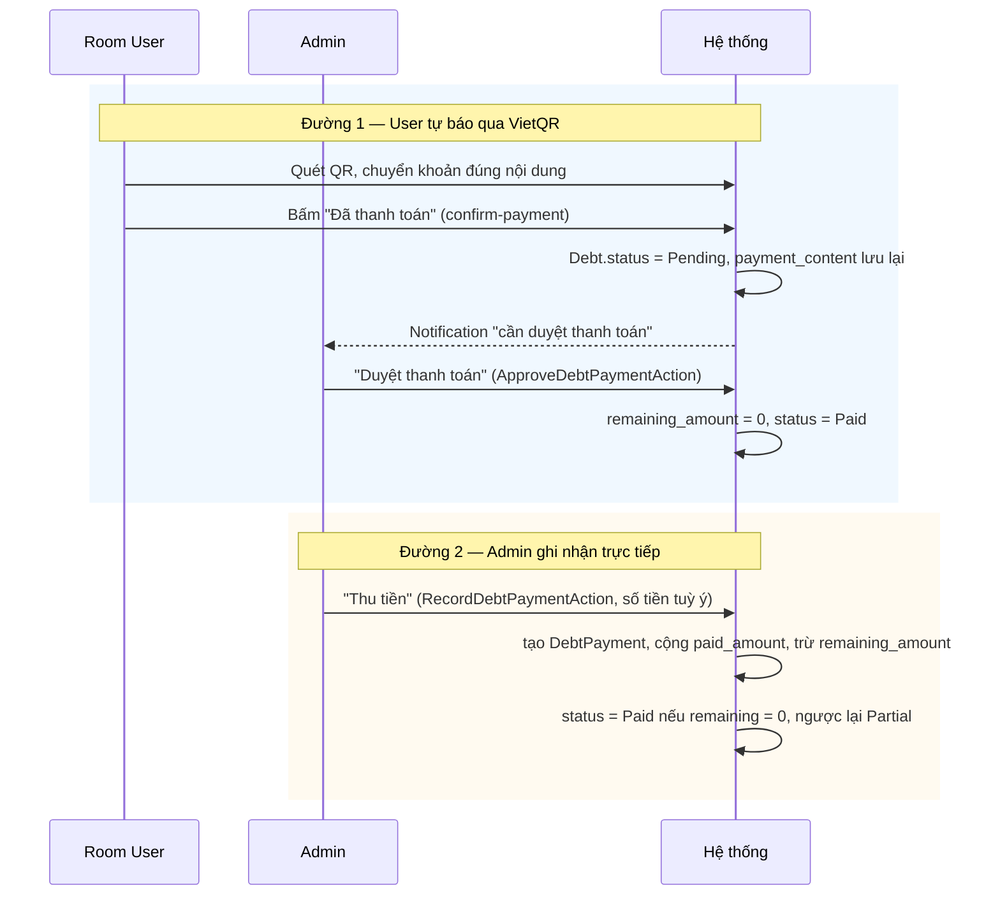

# 7. Thanh toán & Công nợ (Debt)

[← Về Tổng quan nghiệp vụ](overview.md)

Công nợ (`Debt`) phát sinh khi [đóng chiến dịch](03-chien-dich-gom-don.md) (xem công thức ở [bài 6](06-chinh-sach-tai-tro.md)) — chủ nợ (`debtor`) có thể là **thành viên thường** hoặc **Sponsor**, dùng chung một bảng `debts` (`debtor_type`).

## 7.1. Vòng đời `DebtStatus`

## 7.2. Hai đường dẫn tới "Đã thanh toán"

### Cơ chế "Thanh toán tất cả" (Pay-all)

Nếu `payment_content` của một khoản nợ **trùng khớp chính xác** `user_code` của thành viên đó (thay vì mã một khoản nợ cụ thể), hệ thống hiểu đây là **một lần chuyển khoản gộp cho mọi khoản đang `Pending`** của người đó trong Room — `ApproveDebtPaymentAction` sẽ duyệt đồng loạt tất cả các khoản `Pending` cùng lúc thay vì chỉ 1 khoản.

## 7.3. Điều chỉnh thủ công (`DebtAdjustmentType`)

| Loại | Công thức trên `remaining_amount` | Dùng khi |
| --- | --- | --- |
| `Increase` | `+amount` | Phát sinh thêm chi phí sau khi đã chốt nợ |
| `Decrease` | `−amount` | Giảm nợ do sai lệch nhỏ |
| `Waive` | `= 0` (miễn toàn bộ phần còn lại) | Miễn nợ (ví dụ sự cố từ phía Room) |
| `Correction` | `= amount` (đặt lại đúng bằng giá trị mới) | Sửa sai số nhập liệu |

Mọi điều chỉnh đều tạo một bản ghi `DebtAdjustment` (lưu vết before/after + lý do) và không cho phép kết quả âm.

## 7.4. Các khái niệm liên quan

- **`PaymentMethod`**: `Cash`, `Transfer`, `Qr`, `VietQr`, `RoomFund` — cách một `DebtPayment`/`Order` được thanh toán.
- **`PaymentStatus`** (`Unpaid`/`Pending`/`Paid`): trạng thái thanh toán ở cấp **Order**, song song nhưng độc lập với `DebtStatus` ở cấp **Debt** (một Order có thể `Paid` ngay nếu miễn phí hoàn toàn, không tạo `Debt`).
- **`BillSplitMethod`** (`ByOrder`/`SponsorFirst`/`Equal`/`FlatPrice`/`Custom`): quy tắc `SplitCampaignBillAction` dùng khi cần chia lại phí ship/giảm giá sau khi Order đã tồn tại.

## Tham chiếu mã nguồn

`App\Models\Debt`, `DebtPayment`, `DebtAdjustment` · `App\Enums\DebtStatus`, `DebtAdjustmentType`, `PaymentStatus`, `PaymentMethod`, `BillSplitMethod` · `App\Actions\Debt\*` · `App\Services\Debt\DebtSettlementService`, `DebtReminderService` · Xem thao tác UI ở [Hướng dẫn Admin – bài 6](../guildes/admin/06-quan-ly-cong-no.md) và [Hướng dẫn User – bài 5](../guildes/user/05-thanh-toan-cong-no.md).
