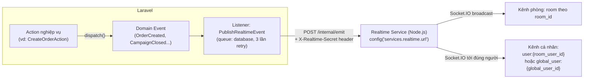

# 8. Thông báo & Realtime

[← Về Tổng quan nghiệp vụ](overview.md)

DrinkFlow tách biệt hai kênh cập nhật: **Notification** (bản ghi lưu trong CSDL, đọc lại được) và **Realtime broadcast** (đẩy tức thời qua Socket.IO, không lưu trữ).

## 8.1. Kiến trúc realtime — Laravel Event → Node.js Socket.IO

> Laravel **không** tự vận hành Socket.IO — nó chỉ gọi một service Node.js độc lập (thư mục `realtime/` trong repo) qua HTTP nội bộ có xác thực bằng secret riêng. Nếu request đó lỗi, job sẽ tự retry theo `backoff = [1, 5, 15]` giây rồi mới thất bại hẳn (`PublishRealtimeEvent`).

## 8.2. Danh sách sự kiện realtime đang phát

| Domain Event | Tên sự kiện Socket | Kênh người nhận riêng |
| --- | --- | --- |
| `OrderCreated` | `order.created` | — (chỉ broadcast theo Room) |
| `OrderUpdated` | `order.updated` (kèm `previous_status`) | — |
| `OrderDeleted` | `order.deleted` | `user:{room_user_id}` |
| `CampaignCreated` | `campaign.created` | — |
| `CampaignUpdated` | `campaign.updated` | — |
| `CampaignClosed` | `campaign.closed` | — |
| `CampaignCancelled` | `campaign.cancelled` | — |
| `CampaignDelivering` | `campaign.delivering` | — |
| `UserNotificationCreated` | `notification.created` | `global_user:{global_user_id}` |
| `RoomMembershipUpdated` | `room.membership.updated` | `global_user:{global_user_id}` |
| `RoomRealtimeEvent` (generic) | tên tự do do nơi gọi chỉ định | tuỳ payload |

Mọi sự kiện đều được broadcast **theo Room** trước, một số kèm thêm kênh cá nhân để người/thiết bị liên quan nhận riêng (ví dụ chủ đơn khi đơn của họ bị xoá).

## 8.3. Notification lưu trữ (`NotificationType`)

`NotificationType` định nghĩa ~20 loại thông báo được lưu bền vững để người dùng xem lại trong Trung tâm thông báo, nhóm theo domain:

- **Chiến dịch**: `campaign.created/updated/closed/cancelled/delivering`
- **Đơn hàng**: `order.created/updated/status/deleted`, `order.proxy_received` (báo người được đặt hộ)
- **Thanh toán/Nợ**: `payment.reminder/due/confirmed`, `debt.reminder/payment_approved/updated/adjusted`
- **Bảo mật/Thiết bị**: `device.new`, `security.alert`
- **Khác**: `room.invite`, `admin.broadcast` (thông báo hàng loạt từ Admin), `notification.test` (test kênh webhook)

## 8.4. Kênh webhook ngoài (Slack/Telegram/Chatwork/Webhook)

Song song với push nội bộ, `RoomNotificationChannelDispatcher` gửi cùng nội dung ra các kênh chat ngoài mà Admin đã kết nối ([bài 9 – hướng dẫn Admin](../guildes/admin/09-kenh-thong-bao-broadcast.md)), dùng cho các sự kiện quan trọng như mở chiến dịch mới hoặc nhắc nợ.

## Tham chiếu mã nguồn

`App\Events\*` (7 event) · `App\Listeners\PublishRealtimeEvent` và các `Notify*` listener · `App\Enums\NotificationType` · `App\Services\Notification\UserNotificationService`, `AdminNotificationService`, `RoomNotificationChannelDispatcher`, `NotificationPresentationService` · thư mục `realtime/` (Node.js Socket.IO server).
