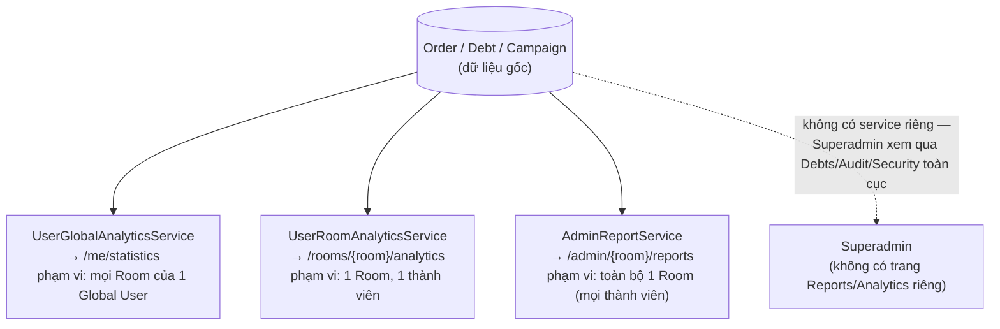

# 9. Báo cáo & Thống kê

[← Về Tổng quan nghiệp vụ](overview.md)

Không có một "module Analytics" tập trung duy nhất — mỗi actor có **service thống kê riêng**, đọc từ cùng nguồn dữ liệu Order/Debt/Campaign nhưng phạm vi khác nhau.

## 9.1. Khoảng thời gian chuẩn hoá (`AnalyticsPeriod`)

`Week` / `Month` / `Quarter` / `Year` — dùng thống nhất ở cả 3 service để tổng hợp theo tuần/tháng/quý/năm, tránh mỗi nơi tự định nghĩa một kiểu lọc thời gian khác nhau.

## 9.2. Phạm vi dữ liệu từng service

| Service | Route sử dụng | Tính theo |
| --- | --- | --- |
| `UserGlobalAnalyticsService` | `user.me.statistics` | Tất cả Order của 1 Global User, gộp qua mọi Room họ tham gia |
| `UserRoomAnalyticsService` | `user.analytics.room` | Order của 1 Room User trong đúng 1 Room |
| `AdminReportService` | `admin.reports.page` | Toàn bộ Order/Debt/Campaign của 1 Room (mọi thành viên), có thêm góc nhìn theo Sponsor |

Cả 3 đều tính chung các trục: **tổng đơn**, **tổng chi tiêu thực trả**, **tổng được tài trợ**, **món/quán phổ biến nhất**, và với Admin có thêm **tỉ lệ tham gia theo từng chiến dịch** (dựa trên `CampaignParticipant`, xem [bài 4](04-dat-mon-gio-hang.md)) và **thống kê công nợ theo từng thành viên** (dựa trên `Debt`, xem [bài 7](07-thanh-toan-cong-no.md)).

## 9.3. Xuất dữ liệu

Cả 3 cấp đều hỗ trợ xuất Excel/CSV (`user.me.statistics.export`, `user.me.payments.export`, `admin.reports.export`, `admin.debts.export`) — export luôn tính lại trực tiếp từ CSDL tại thời điểm bấm nút, không cache số liệu cũ.

## Tham chiếu mã nguồn

`App\Services\Analytics\UserGlobalAnalyticsService`, `UserRoomAnalyticsService` · `App\Services\Admin\AdminReportService` · `App\Enums\AnalyticsPeriod` · Xem thao tác UI ở [Hướng dẫn User – bài 6](../guildes/user/06-thong-ke-chi-tieu.md) và [Hướng dẫn Admin – bài 10](../guildes/admin/10-bao-cao-thong-ke.md).
