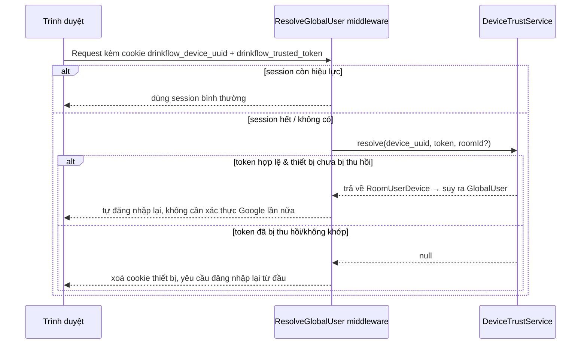

# 10. Bảo mật, Thiết bị & Audit

[← Về Tổng quan nghiệp vụ](overview.md)

DrinkFlow ghi vết theo **hai bảng riêng biệt** với mục đích khác nhau — dễ nhầm lẫn nên tách thành một nghiệp vụ độc lập.

| | `AuditLog` | `SecurityEvent` |
| --- | --- | --- |
| Mục đích | Lưu vết **thay đổi nghiệp vụ** (before/after) | Lưu vết **sự kiện bảo mật** (mức độ nghiêm trọng `severity`) |
| Ví dụ | `order.price_adjusted`, `campaign.closed`, `room_user.blocked` | Đăng nhập sai nhiều lần, thiết bị lạ, thu hồi token |
| Ai xem được | Admin (phạm vi Room mình quản lý) qua [Nhật ký hoạt động](../guildes/admin/11-nhat-ky-hoat-dong.md) | Chỉ **Superadmin**, toàn hệ thống (`/superadmin/security-events`) |
| Model | `App\Models\AuditLog` (`actor_type/id`, `target_type/id`, `room_id`, `before_data`, `after_data`) | `App\Models\SecurityEvent` (`type`, `severity`, `actor_type/id`, `room_id`, `device_uuid`) |

## 10.1. Ghi Audit Log — mẫu dùng chung

Mọi Action làm thay đổi dữ liệu tài chính/trạng thái quan trọng đều gọi `AuditService::record()` ngay trong transaction:

```php
app(AuditService::class)->record(
    'order.price_adjusted',      // tên sự kiện
    'order', $order->id,         // loại + ID đối tượng bị tác động
    $order->room_id,             // phạm vi Room
    $before,                     // dữ liệu trước khi đổi
    $after                       // dữ liệu sau khi đổi
);
```

Nhờ vậy mọi thay đổi giá đơn, đóng/huỷ chiến dịch, khoá/mở thành viên... đều có thể tra soát ngược lại **ai đổi, đổi gì, từ giá trị nào sang giá trị nào**.

## 10.2. Thiết bị tin cậy (Device Trust)



Điểm bảo mật quan trọng: nếu Admin **thu hồi** một `RoomUserDevice` trong khi trình duyệt đó **vẫn còn session hợp lệ**, middleware sẽ phát hiện thiết bị bị thu hồi không khớp với `global_user_id` hiện tại của session và **buộc đăng xuất ngay**, không đợi session tự hết hạn (`ResolveGlobalUser::handle`) — tránh trường hợp thu hồi thiết bị nhưng người dùng vẫn còn truy cập được.

## 10.3. Ai được xem gì

- **Admin**: chỉ xem Audit Log trong **phạm vi Room mình quản lý** (`admin.audit.page`), không thấy Security Event hay Audit Log của Room khác.
- **Superadmin**: xem toàn bộ Audit Log + Security Event + trang giám sát Socket/Queue hệ thống (xem [bài 11](11-quan-tri-he-thong-superadmin.md)).
- **User**: tự quản lý thiết bị của chính mình qua [Bảo mật & thiết bị](../guildes/user/08-bao-mat-thiet-bi.md), không xem được Audit Log hay Security Event.

## Tham chiếu mã nguồn

`App\Models\AuditLog`, `SecurityEvent`, `RoomUserDevice` · `App\Services\Audit\AuditService` · `App\Services\Auth\DeviceTrustService` · `App\Http\Middleware\ResolveGlobalUser`.
