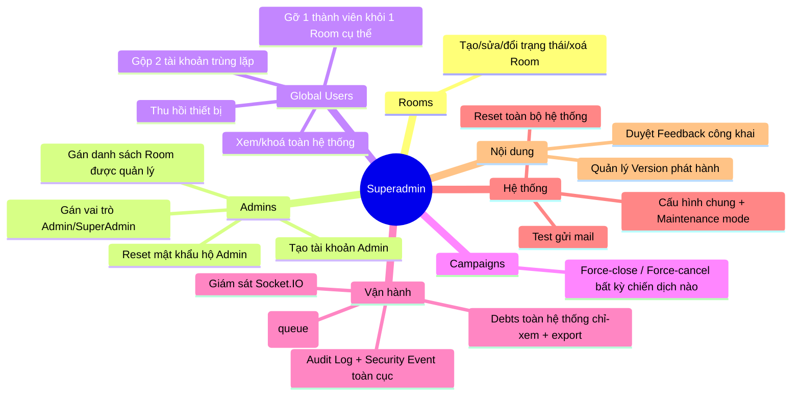
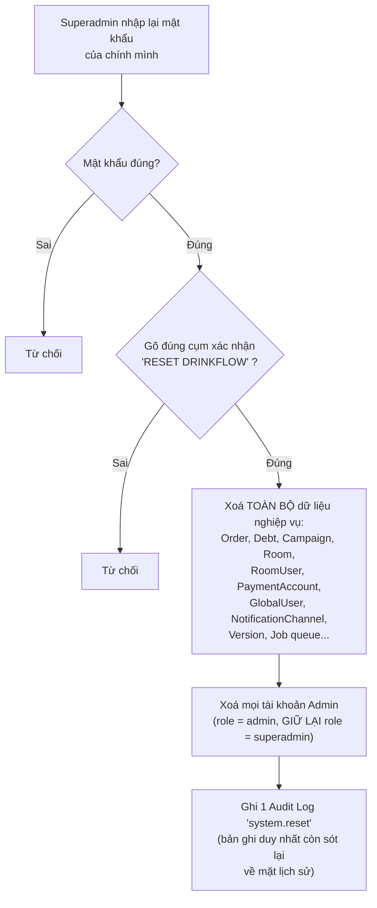

# 11. Quản trị hệ thống (Superadmin)

[← Về Tổng quan nghiệp vụ](overview.md)

Superadmin là `AdminRole::SuperAdmin` — không bị middleware `admin.room` giới hạn, thao tác được trên **toàn bộ** Room/Admin/Global User/hệ thống (`routes/superadmin.php`).

## 11.1. Bản đồ chức năng

## 11.2. Gán quyền Admin cho Room

Quan hệ nhiều-nhiều Admin↔Room được Superadmin thiết lập qua `PUT /superadmin/admins/{admin}/rooms` (`ManageAdminAction`) — đây là **nguồn dữ liệu duy nhất** mà middleware `admin.room` dùng để quyết định một Admin có được vào một Room hay không (xem [bài 1](01-xac-thuc-phan-quyen.md)).

## 11.3. Gộp tài khoản Global User trùng lặp

Dùng khi một nhân sự vô tình tạo 2 danh tính (ví dụ đăng nhập bằng 2 domain email khác nhau). `MergeGlobalUsersAction`:

1. Từ chối nếu `source` và `target` cùng là thành viên của **một Room nào đó** (xung đột membership — cần xử lý thủ công trước).
2. Từ chối nếu 2 tài khoản có cùng một danh tính OAuth (không nên xảy ra).
3. Chuyển toàn bộ `OAuthIdentity` và `RoomUser` từ `source` sang `target`, sau đó **xoá vĩnh viễn** `source`.
4. Ghi `AuditLog` sự kiện `global_user.merged`.

## 11.4. Reset toàn bộ hệ thống — thao tác không thể hoàn tác

> **Cảnh báo**: `ResetSystemAction` xoá dữ liệu ở **23 bảng** trong một transaction — không có cơ chế khôi phục nào trong ứng dụng. Đây là chức năng dành cho môi trường thử nghiệm/demo, không phải thao tác vận hành thông thường.

## 11.5. Vận hành nền

- **Queue thất bại** (`/superadmin/queue/failed`): xem, retry hoặc xoá hẳn (`forget`) các job Laravel bị lỗi — ví dụ job gửi realtime event/thông báo thất bại nhiều lần.
- **Giám sát Socket** (`/superadmin/socket`): theo dõi tình trạng kết nối của service Node.js realtime ([bài 8](08-thong-bao-realtime.md)).
- **Chế độ bảo trì** (`system.maintenance`): bật/tắt để chặn truy cập tạm thời khi triển khai.

## Tham chiếu mã nguồn

`routes/superadmin.php` · `App\Actions\Superadmin\ManageAdminAction`, `ManageRoomAction`, `MergeGlobalUsersAction`, `ResetSystemAction` · `App\Models\AdminAccount` (`AdminRole`, `AdminStatus`) · Middleware `superadmin`.
