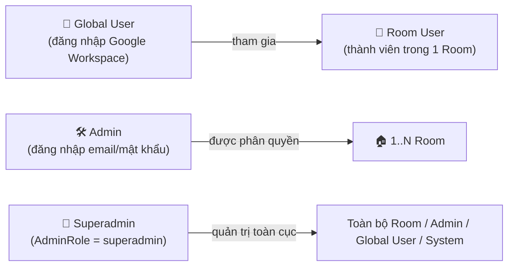
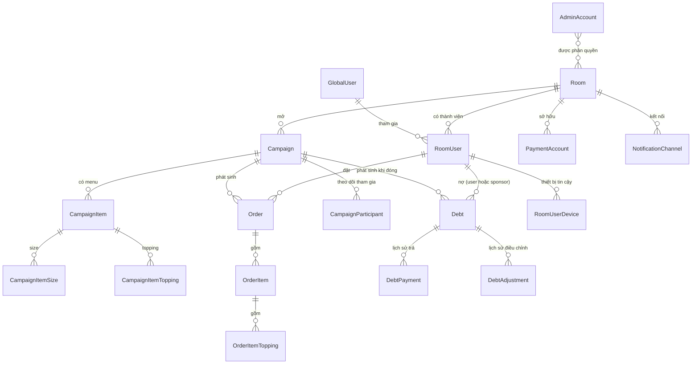

# Tổng quan nghiệp vụ DrinkFlow

Tài liệu này phân tích DrinkFlow theo **từng nghiệp vụ** (business domain) thay vì theo vai trò người dùng — mục tiêu là hiểu **luồng dữ liệu, quy tắc nghiệp vụ và vòng đời trạng thái** đứng sau các màn hình, để phát triển/bảo trì hệ thống chính xác hơn.

> Khác với tài liệu hướng dẫn thao tác ([`documents/guildes/user/`](../guildes/user/README.md), [`documents/guildes/admin/`](../guildes/admin/README.md)) vốn mô tả **"bấm nút gì"**, tài liệu này mô tả **"hệ thống xử lý ra sao"**: Model, Enum trạng thái, Action/Service, Event và các công thức tính toán thực tế trong mã nguồn.

## Ba nhóm tác nhân (Actor)

- **Global User**: danh tính duy nhất toàn hệ thống (`GlobalUser`), có thể là thành viên (`RoomUser`) của nhiều Room.
- **Admin**: tài khoản vận hành (`AdminAccount`) được gán quyền quản lý một tập Room cụ thể (bảng phân quyền Admin↔Room).
- **Superadmin**: một `AdminRole` đặc biệt của Admin, không giới hạn theo Room, quản lý toàn hệ thống.

## Mục lục 11 nghiệp vụ

| # | Nghiệp vụ | Trạng thái/Enum chính | Actor liên quan |
| - | --------- | ---------------------- | ---------------- |
| 1 | [Xác thực & Phân quyền](01-xac-thuc-phan-quyen.md) | `GlobalUserStatus`, `AdminStatus`, `AdminRole` | Cả 3 |
| 2 | [Quản lý Room & Thành viên](02-quan-ly-room-thanh-vien.md) | `RoomStatus`, `RoomUserStatus` | User, Admin |
| 3 | [Chiến dịch gom đơn](03-chien-dich-gom-don.md) | `CampaignStatus`, `CampaignItemStatus` | Admin, User |
| 4 | [Đặt món & Giỏ hàng](04-dat-mon-gio-hang.md) | `CampaignParticipant.status` | User |
| 5 | [Vận hành đơn hàng](05-van-hanh-don-hang.md) | `OrderStatus` | Admin, User |
| 6 | [Chính sách Tài trợ (Sponsor)](06-chinh-sach-tai-tro.md) | `Campaign::SPONSOR_TYPE_*` | Admin |
| 7 | [Thanh toán & Công nợ](07-thanh-toan-cong-no.md) | `DebtStatus`, `PaymentStatus`, `DebtAdjustmentType`, `BillSplitMethod` | Admin, User |
| 8 | [Thông báo & Realtime](08-thong-bao-realtime.md) | `NotificationType` | Cả 3 |
| 9 | [Báo cáo & Thống kê](09-bao-cao-thong-ke.md) | `AnalyticsPeriod` | Admin, User, Superadmin |
| 10 | [Bảo mật, Thiết bị & Audit](10-bao-mat-thiet-bi-audit.md) | Device trust, `AuditLog`, `SecurityEvent` | Cả 3 |
| 11 | [Quản trị hệ thống (Superadmin)](11-quan-tri-he-thong-superadmin.md) | — | Superadmin |

## Sơ đồ quan hệ dữ liệu cốt lõi (rút gọn)

## Nguồn đối chiếu

Toàn bộ nội dung trong 11 file chi tiết được đối chiếu trực tiếp với:

- `app/Enums/*.php` — định nghĩa trạng thái chính thức.
- `app/Actions/**/*.php`, `app/Services/**/*.php` — logic nghiệp vụ thực thi.
- `app/Events/*.php`, `app/Listeners/*.php` — luồng sự kiện/realtime.
- `routes/user.php`, `routes/admin.php`, `routes/superadmin.php` — bề mặt API/route theo từng actor.
