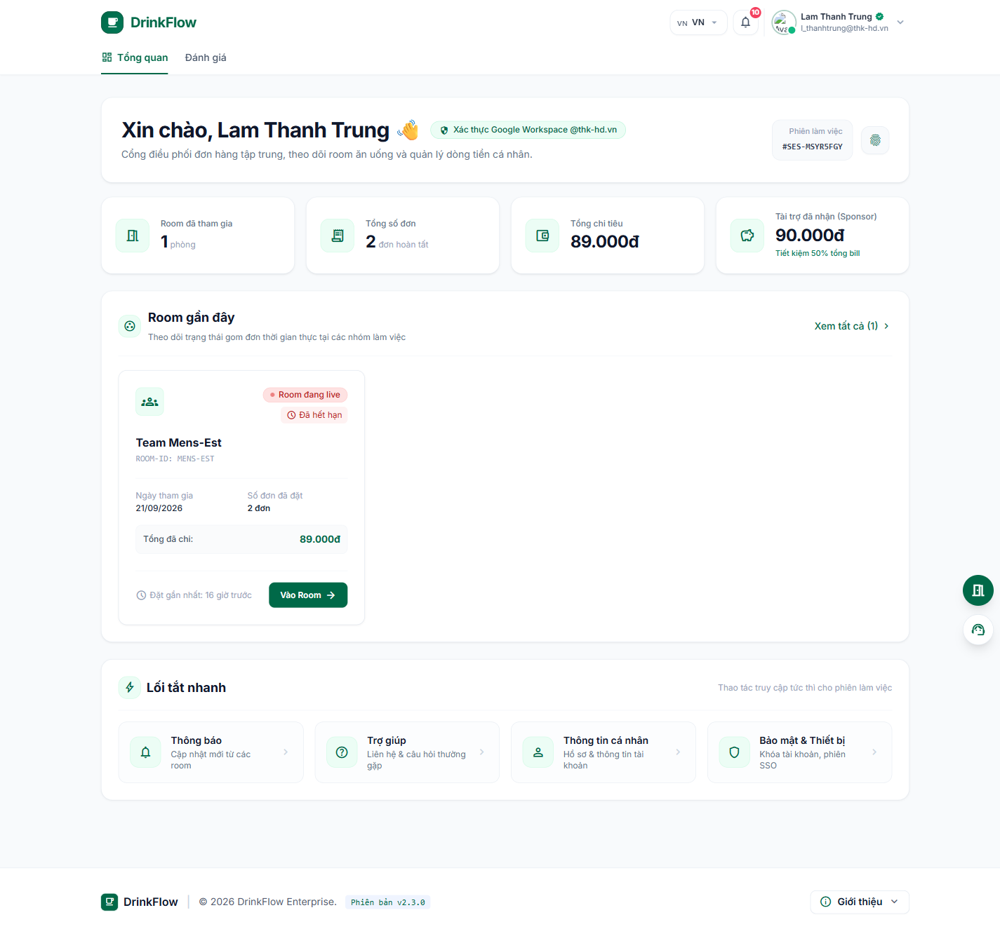

# 1. Đăng nhập & Cổng thông tin cá nhân

<strong>📑 Menu điều hướng</strong> — bấm để chuyển nhanh sang trang khác

- [🏠 Trang chủ / Mục lục](README.md)
- **1. Đăng nhập & Cổng thông tin cá nhân** ← *đang xem*
- [2. Tham gia & quản lý Room](02-tham-gia-va-quan-ly-room.md)
- [3. Đặt món trong chiến dịch gom đơn](03-dat-mon-chien-dich.md)
- [4. Theo dõi đơn hàng](04-theo-doi-don-hang.md)
- [5. Thanh toán & Công nợ](05-thanh-toan-cong-no.md)
- [6. Thống kê chi tiêu](06-thong-ke-chi-tieu.md)
- [7. Hồ sơ cá nhân](07-ho-so-ca-nhan.md)
- [8. Bảo mật & thiết bị đăng nhập](08-bao-mat-thiet-bi.md)
- [9. Thông báo](09-thong-bao.md)
- [10. Đánh giá & góp ý](10-danh-gia-gop-y.md)
- [11. Khi tài khoản bị khoá / hạn chế](11-tai-khoan-bi-khoa.md)
- [12. Đặt món giúp thành viên khác (Order dùm)](12-dat-ho-thanh-vien-khac.md)
- [13. Món trả riêng (không dùng tài trợ)](13-mon-tra-rieng.md)

## 1.1. Đăng nhập bằng Google Workspace

DrinkFlow **không dùng mật khẩu riêng**. Bạn đăng nhập bằng chính tài khoản Google Workspace của công ty (email dạng `ten@congty.com`) — đây gọi là **Single Sign-On (SSO)**.

Các bước:

1. Mở trang chủ DrinkFlow (do công ty/Host cung cấp, ví dụ `https://drinkflow.công-ty-của-bạn.vn`).
2. Bấm nút **"Tiếp tục với Google Workspace"**.
3. Một cửa sổ đăng nhập Google hiện ra — chọn đúng tài khoản email công ty của bạn (chỉ các tên miền được quản trị viên cấp phép mới đăng nhập được).
4. Sau khi xác thực thành công, hệ thống tự động đưa bạn vào **Cổng thông tin cá nhân** tại địa chỉ `/me`.

> **Lưu ý:** Nếu bạn bấm vào một link Room (ví dụ link Host gửi trong Slack) khi chưa đăng nhập, hệ thống sẽ đưa bạn về trang chủ kèm thông báo yêu cầu đăng ký/đăng nhập trước. Sau khi đăng nhập xong, bạn có thể dán lại link Room đó để tiếp tục tham gia (xem [bài 2](02-tham-gia-va-quan-ly-room.md)).

## 1.2. Làm quen giao diện Cổng thông tin cá nhân (`/me`)

Đây là trang bạn nhìn thấy đầu tiên sau khi đăng nhập — trung tâm điều phối chung cho toàn bộ tài khoản của bạn trên mọi Room.

Các khu vực chính trên trang:

- **Thanh trên cùng:** logo DrinkFlow (bấm để quay lại `/me`), nút chọn ngôn ngữ (🇻🇳/🇬🇧/🇯🇵), chuông **Thông báo**, và avatar tài khoản ở góc phải.
- **4 thẻ số liệu tổng quan:** *Room đã tham gia*, *Tổng số đơn*, *Tổng chi tiêu*, *Tài trợ đã nhận (Sponsor)*.
- **Room gần đây:** danh sách các Room bạn đang tham gia, có đợt gom đơn đang mở hay không, số đơn/số tiền đã chi tại từng Room — bấm **"Vào Room"** để vào làm việc trong Room đó.
- **Lối tắt nhanh:** truy cập nhanh **Thông báo**, **Trợ giúp**, **Thông tin cá nhân**, **Bảo mật & Thiết bị**.
- **Nút nổi góc dưới phải:** biểu tượng cửa 🚪 để **"Đăng ký tham gia phòng"** mới bất cứ lúc nào, và biểu tượng tai nghe để **"Liên hệ & Hỗ trợ"**.

Bấm vào avatar ở góc phải trên cùng để mở menu tài khoản gồm: **Hồ sơ khẩu vị**, **Bảo mật & Thiết bị**, **Cài đặt thông báo** và **Đăng xuất**.

## 1.3. Đăng xuất

1. Bấm vào avatar của bạn ở góc trên bên phải.
2. Chọn **"Đăng xuất"**.
3. Xác nhận trong hộp thoại **"Xác nhận đăng xuất"**.

Sau khi đăng xuất, bạn cần đăng nhập lại bằng Google Workspace để tiếp tục sử dụng DrinkFlow. Nếu chỉ nghi ngờ có người khác đăng nhập trên thiết bị khác (không phải thiết bị bạn đang cầm), hãy dùng chức năng **đăng xuất từ xa** ở [bài 8 – Bảo mật & thiết bị](08-bao-mat-thiet-bi.md) thay vì đăng xuất thiết bị hiện tại.

---

⬅️ [🏠 Mục lục](README.md) &nbsp;|&nbsp; [Trang sau: 2. Tham gia & quản lý Room ➡️](02-tham-gia-va-quan-ly-room.md)
